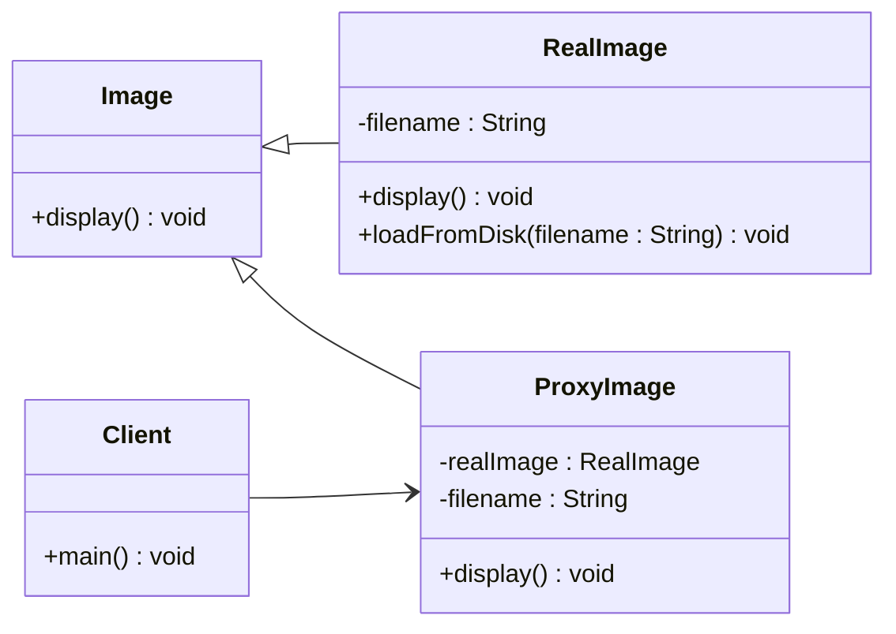
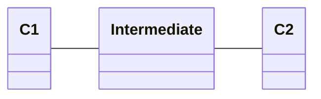
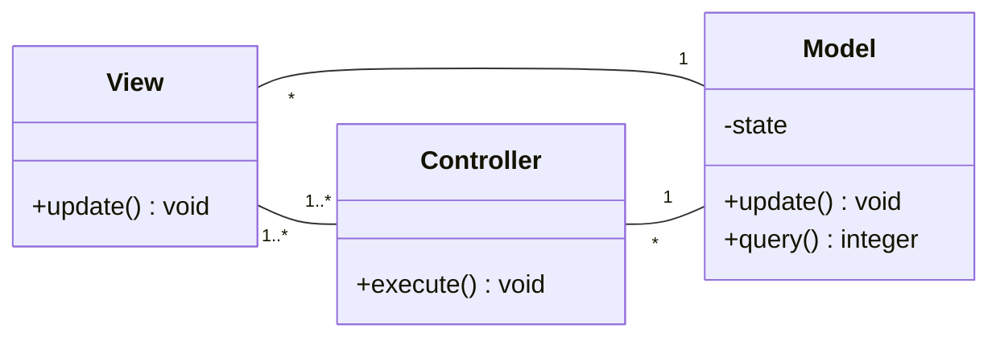
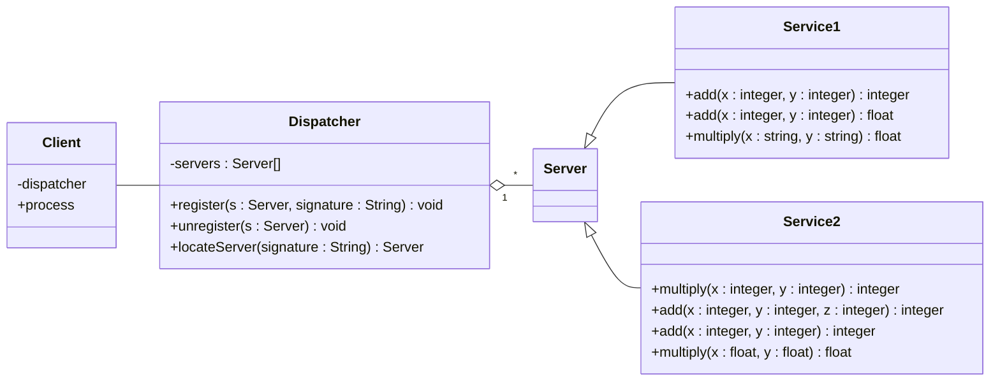
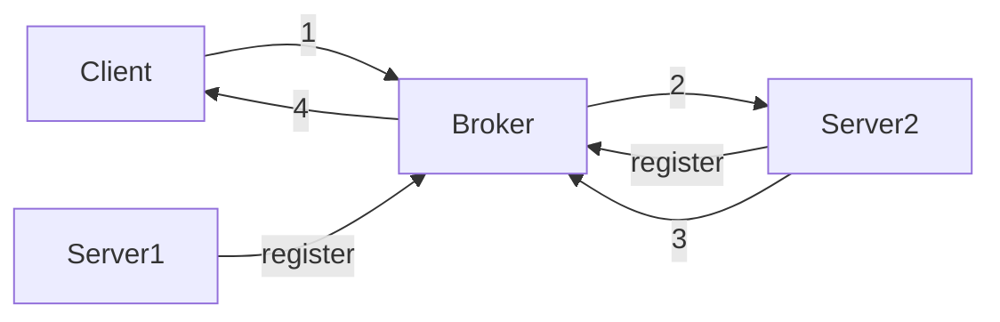

# Architectural patterns

- Proxy pattern
- De-coupling pattern
- Model-view-controller pattern
- Client-server pattern

## Proxy pattern

The proxy and the real subject share the same interface.

## De-coupling pattern

Introduce an intermediary to weaken coupling between modules.

## Model-view-controller pattern

The same information is represented differently in different UIs.

## Client-server pattern

- Client-dispatcher-server
- Client-broker-server

### Client-dispatcher-server

Clients locate server address and get service from the server. The client
communicates directly with the server.

### Client-broker-server

The client communicates with the server via a broker.

1.  Client requests service
1.  Broker forwards the service request to the server
1.  Server replies to the broker
1.  Broker forwards the reply to client

