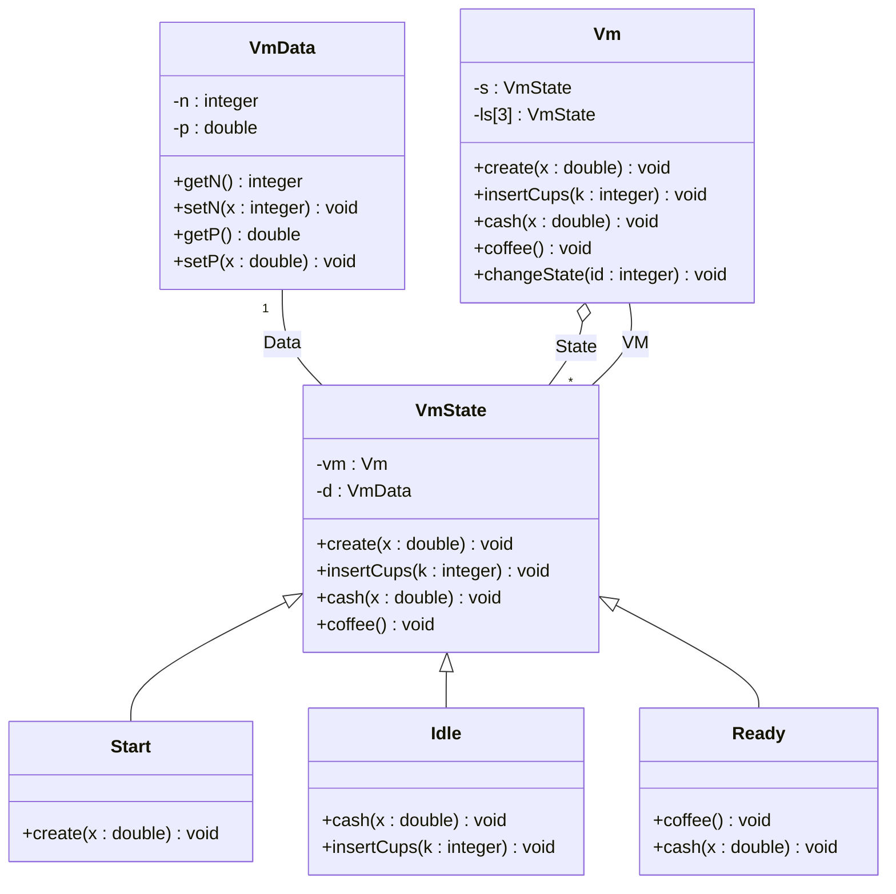
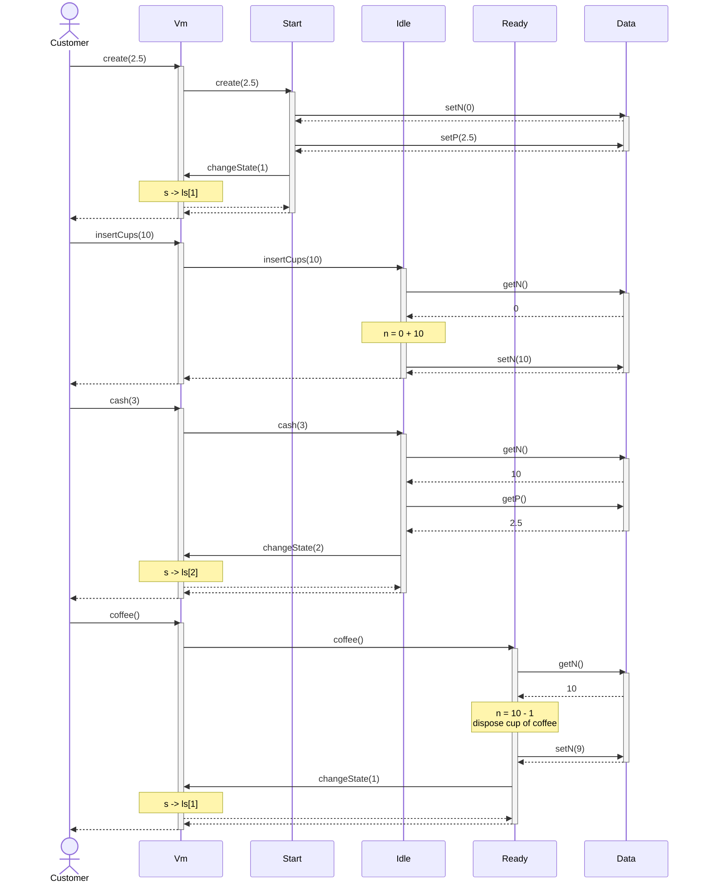
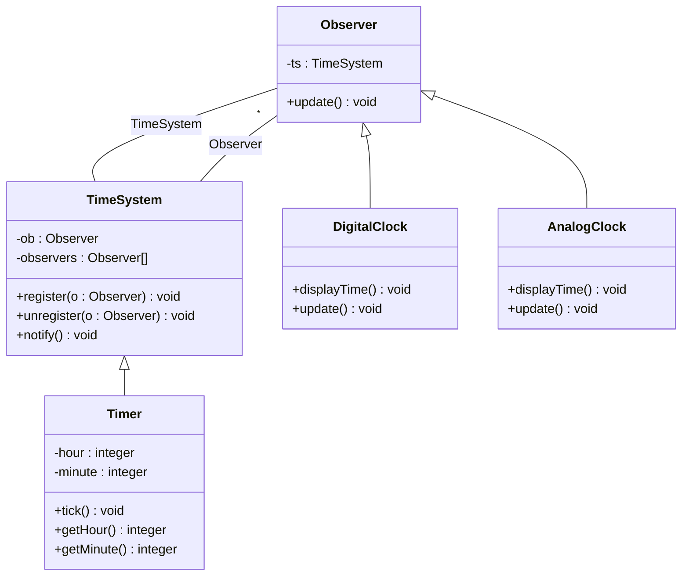
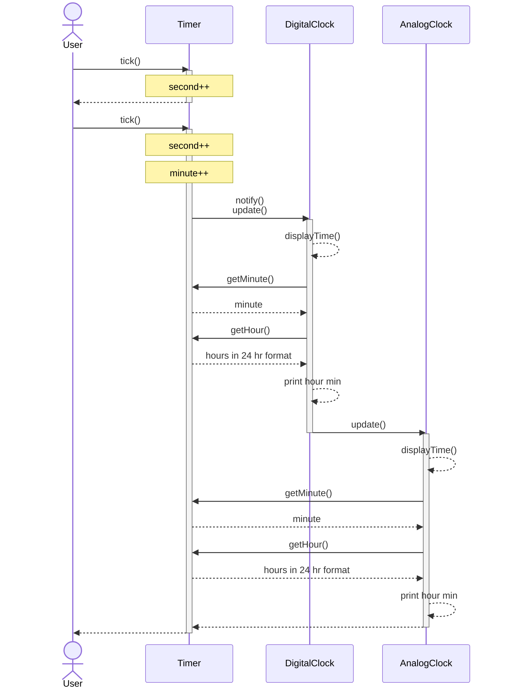
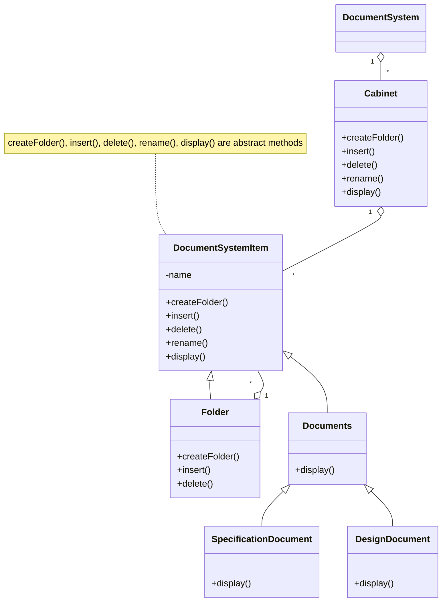

# [Exam 1](https://github.com/hanggrian/IIT-CS586/blob/assets/assignments/exam1_1.pdf)

## Problem 1

> An EFSM (Extended Finite State Machine) of a component is shown below. The
  component supports the following operations: `create(float x)`,
  `cash(float x)`, `insert_cups(int k)`, `coffee()`
>
> Design the system using the **State design pattern.** You should use the
  **decentralized** version of this pattern.
>
> In your solution:
>
> 1.  Provide a class diagram for the component. For each class list all
      operations with parameters and specify them using **pseudo-code.** In
      addition, for each class provide its attributes and data structures. Make
      the necessary assumptions for your design. Notice that the components in
      your design should be de-coupled as much as possible. In addition,
      components should have high cohesion.
> 1.  Provide a sequence diagram for the following operation sequence:
      `create(2.5)`, `insert_cups(10)`, `cash(3)`, `coffee()`
>
> ```mermaid
> ---
> config:
>   flowchart:
>     defaultRenderer: "elk"
> ---
> flowchart LR
>   Start -- create(x) / n = 0; p = x --> Idle
>   Idle -- cash(x)[(x < p) || (n < 1)] / return cash --> Idle
>   Idle -- cash(x)[(x >= p) && (n > 0)] --> Ready
>   Ready -- cash(x) / return cash --> Ready
>   Idle -- insert_cups(k)[k > 0] / n = n + k --> Idle
>   Ready -- coffee[n > 0] / n = n - 1; dispose cup of coffee --> Idle
> ```



```vb
class Vm {
  State s 'Current state object'
  State ls[0] 'Start object'
  State ls[1] 'Idle object'
  State ls[2] 'Ready object'

  Vm() {
    s <- ls[0] 'initialize state to Start'
  }

  void changeState(integer id) {
    s <- ls[id]
  }

  void create(double x) {
    s <- create(x)
  }

  void insertCups(integer k) {
    s <- insertCups(k)
  }

  void cash(double x) {
    s <- cash(x)
  }

  void coffee() {
    s <- coffee()
  }
}

abstract class VmState {
  abstract create(double x)
  abstract insertCups(integer k)
  abstract cash(double x)
  abstract coffee()
}

class Start {
  void create(double x) {
    d <- setN(0)
    d <- setP(x)
    vm <- changeState(1) 'change state from Start to Idle'
  }
}

class Idle {
  void cash(double x) {
    IF x >= d.getP() AND d.getN() > 0 THEN
      vm <- changeState(2) 'change state from Idle to Ready'
    ELSE IF x < d.getP() OR d.getN() < 1 THEN
      return cash
    END IF
  }

  void insertCups(integer k) {
    IF k > 0 THEN
      numberOfCups <- d.getN()
      numberOfCups <- numberOfCups + k
      d <- setN(numberOfCups)
    END IF
  }
}

class Ready {
  void coffee() {
    IF d.getN() > 0 THEN
      numberOfCups <- d.getN()
      numberOfCups <- numberOfCups - 1
      d <- setN(numberOfCups)
      'dispose cup of coffee'
      vm <- changeState(1) 'change state from Ready to Idle'
    END IF
  }

  void cash(double x) {
    return cash
  }
}

class VmData {
  integer n 'number of cups'
  double p 'price'

  integer getN() {
    return n
  }

  void setN(integer x) {
    n <- x
  }

  double getP() {
    return p
  }

  void setP(double x) {
    p <- x
  }
}
```



## Problem 2

> In the system there exists a class *Timer* whose object stores and maintains
  the time of a day. This class supports the following operations: `Tick()`,
  `GetHour()`, and `GetMinute()`. The `Tick()` operation is called by an
  internal timer every 1 second. `Tick()` operation updates the *Timer's*
  internal state (time data structure). Operations `GetHour()` and `GetMinute()`
  provide the interface for retrieving individual time units such as an hour and
  a minute.
>
> In addition, there exist clock components in the system (e.g., *DigitalClock,
  AnalogClock,* etc.) that are responsible for displaying the time of the
  *Timer* component with a precision to a minute. Design a software subsystem
  using the **Observer** design pattern in which interested clock components can
  be updated about the current time of the *Timer* component.
>
> ```mermaid
> classDiagram
>   class Timer {
>     -hour : integer
>     -minute : integer
>     +tick()
>     +getHour()
>     +getMinute()
>   }
>   class DigitalClock {
>     +displayTime()
>   }
>   class AnalogClock {
>     +displayTime()
>   }
> ```
>
> 1.  Provide a class diagram for the system. The class diagram should include
      classes *Timer, DigitalClock* and *AnalogClock* (if necessary introduce
      new classes and operations). In your design it should be easy to introduce
      new types of clock components (e.g., *AlarmClock*) that are interested in
      observing the time of the *Timer* component. For each class list
      operations and briefly describe their (operations) functionality. Notice
      that the components in your design should be de-coupled as much as
      possible. In addition, components should have high cohesion.
> 1.  Provide a sequence diagram showing how the system notifies a registered
      digital clock and an analog clock about time change.
>
> **Note:** Assume that the *Timer* and *Clocks* are in the same time zone and
  use the *24-hour time format* (e.g., 16:24).



```vb
class TimeSystem {
  register(Observer o) {
    'add Observer to Observers[]'
  }

  unregister(Observer o) {
    'remove Observer from Observers[]'
  }

  notify() {
    FOR EACH ob IN observers DO
      ob <- update()
    END FOR
  }
}

class Timer {
  void tick() {
    second <- second + 1
    IF second = 60 THEN
      second <- 0
      minute <- minute + 1
      IF minute = 60 THEN
        minute <- 0
        IF hour = 23 THEN
          hour <- 0
        ELSE
          hour <- hour + 1
        END IF
      END IF
      notify()
    END IF
  }

  integer getHour() {
    'return hour in 24 hr format'
  }

  integer getMinute() {
    'return minute'
  }
}

class Observer {
  void update() {
    'if observer is interested in new time, then call displayTime()'
  }

  void displayTime() {
    h <- getMinute()
    m <- getHour()
    print(h + ":" + m)
  }
}
```



## Problem 3

> A document system consists of a set of cabinets as shown below:
>
> ```mermaid
> classDiagram
>   direction RL
>   class DocumentSystem {
>   }
>   class Cabinet {
>     +createFolder()
>     +insert()
>     +delete()
>     +rename()
>     +display()
>   }
>   Cabinet "*" --o DocumentSystem
> ```
>
> Each cabinet contains folders and documents. A folder is a group of documents.
  In addition, a folder may contain another folders. Currently, the document
  system supports two types of documents: specification documents and design
  documents. In addition the system supports the following operations:
>
> - `create_folder()` &mdash; a folder is created
> - `insert()` &mdash; a document or a folder is inserted
> - `delete()` &mdash; a document or folder is deleted
> - `rename()` &mdash; a document or folder is renamed
> - `display()` &mdash; a document is displayed
>
> Develop a class diagram for the document system using the **Whole-Part design
  pattern.**
>
> Provide a class diagram for the document system. Identify operations and major
  attributes for each class. Identify necessary changes to the design when a new
  type of document is incorporated into the document system. Notice that
  required changes should be **minimal.**
>
> **Note:** You do not have to specify the operations in classes.


