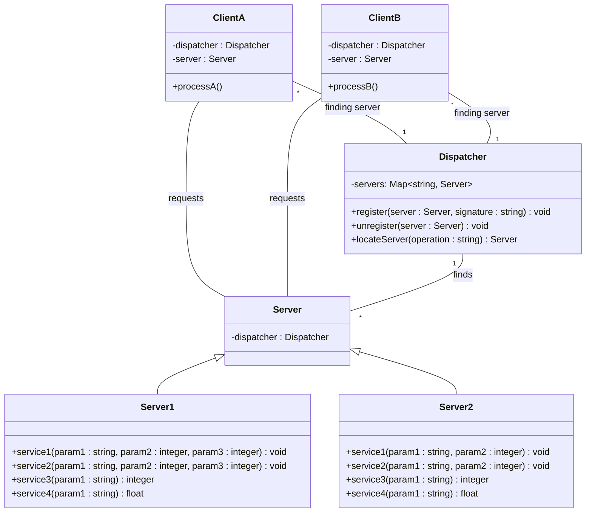
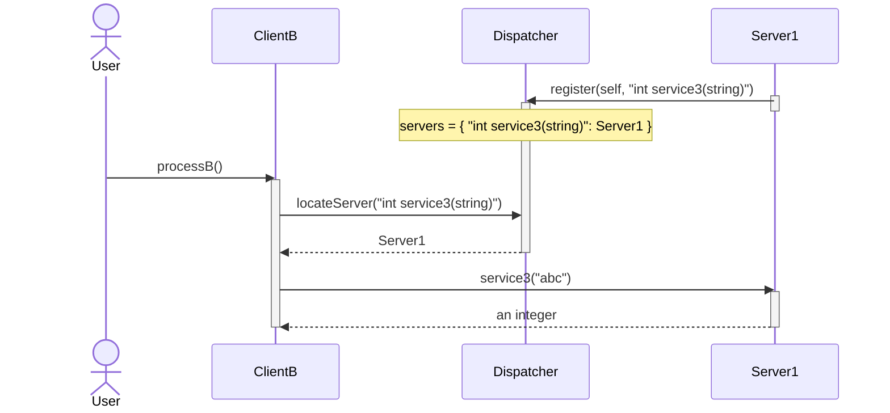
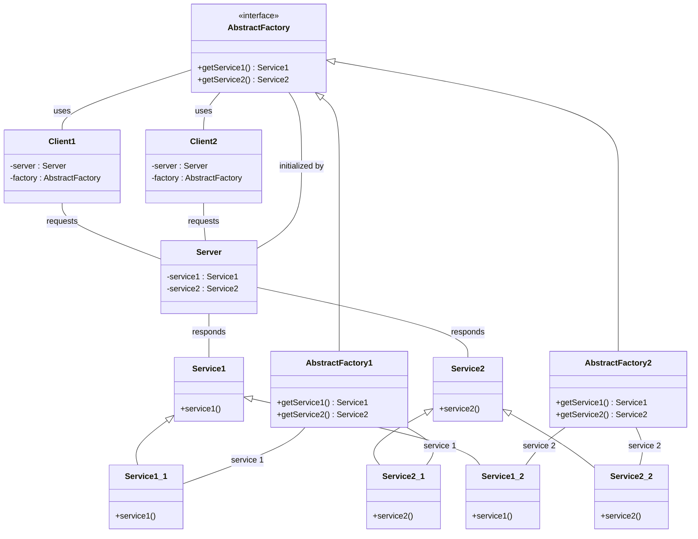
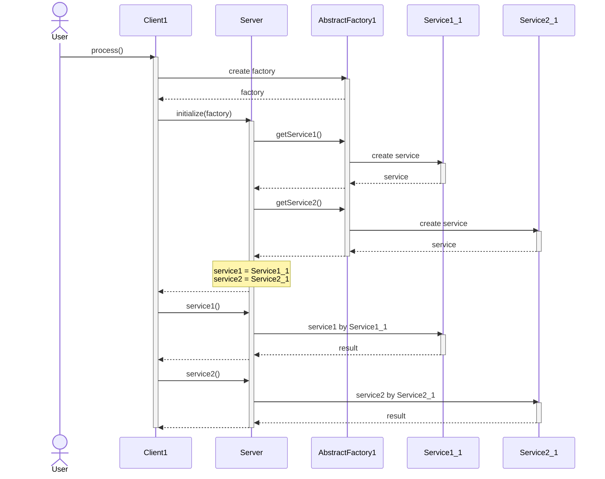
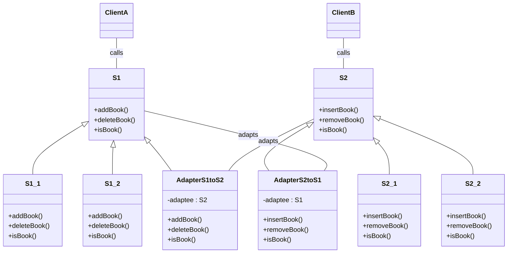
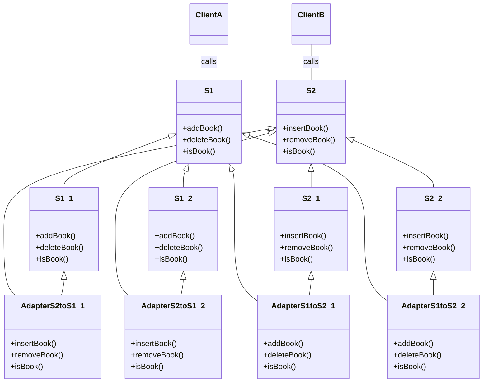

# [Exam 2](https://github.com/hanggrian/IIT-CS586/blob/assets/assignments/exam2_1.pdf)

> Notice that none of the class diagrams shown in the problem statement should
  be modified. Provide a class diagram and briefly describe the responsibility
  of each class and the functionality of each operation using pseudo-code. You
  do not have to provide any description for classes/operations of the above
  class diagram (only new classes/operations should be described). In your
  design, all components should be decoupled as much as possible.

## Problem 1

> There exist two servers **S1** and **S2.** Both servers support the following
  services:
>
> Services supported by **server-S1:**
>
> - `void service1(string, integer, integer)`
> - `void service2(string, integer, integer)`
> - `integer service3(string)`
> - `float service4(string)`
>
> Services supported by **server-S2:**
>
> - `void service1(string, integer)`
> - `void service2(string, integer)`
> - `integer service3(string)`
> - `float service4(string)`
>
> There exist two client processes *processA()* and *processB(),* and they
  request the following services:
>
> **Client1:**
>
> - `void service1(string, integer, integer)`
> - `void service2(string, integer)`
> - `integer service3(string)`
> - `float service4(string)`
>
> **Client2:**
>
> - `void service1(string, integer)`
> - `void service2(string, integer, integer)`
> - `integer service3(string)`
> - `float service4(string)`
>
> The client processes do not know the location (pointer) to servers that may
  provide these services. Devise a software architecture using a
  **Client-Dispatcher-Server** architecture for this problem. In this design,
  the client processes are not aware of the location of the servers providing
  these services.
>
> - Provide a class diagram for this architecture.
> - Describe each component (class) of your design and operations supported by
    each class using the **pseudo-code.** However, you do not have to specify
    operations of **Server-1,Server-2** and **Client1.** For Client2 only
    operation *processB()* must be specified using pseudo-code showing how
    *processB()* gets `int service3(string)` service. In your design all
    components should be **decoupled** as much as possible.
> - Provide a sequence diagram to show how *processB()* of Client2 gets
    `int service3(string)` service.

### Class diagram



### Pseudo-code

```vb
class ClientB {
  Dispatcher dispatcher
  Server server

  void processB() {
    server <- dispatcher.locateServer("int service3(string)")
    integer result <- server.service3("abc")
  }
}

class Dispatcher {
  Map<string, Server> servers

  void register(Server server, string operation) {
    servers.put(operation, server)
  }

  void unregister(Server server) {
    FOR operation IN servers DO
      ServerProxy p <- servers.get(operation)
      IF p == proxy THEN
        servers.remove(operation)
      END IF
    END FOR
  }

  Server locateServer(string operation) {
    ServerProxy proxy <- proxies.get(operation)
    return proxy
  }
}
```

### Sequence diagram



## Problem 2

> There exist two clients (*Client1* and *Client2*) and a *Server.* The server
  provides two services: *service1()* and *service2().* There exist two versions
  of *service1()*: *service1_1()* and *service1_2().* In addition, there exist
  two versions of *service2()*: *service2_1()* and *service2_2(),* where:
>
> - *Client1* invokes *service1_1()* and *service2_1()*
> - *Client2* invokes *service1_2()* and *service2_2()*
>
> The current design is shown below:
>
> ```mermaid
> classDiagram
>   direction LR
>   class Server {
>     +service1_1()
>     +service1_2()
>     +service2_1()
>     +service2_2()
>   }
>   Client1 -- Server
>   Client2 -- Server
> ```
>
> In a better design, clients should be shielded from different versions of
  *service1()* and *service2().* In the new design shown below:
>
> - *Client1* should invoke *service1()* and *service2()* to execute
    *service1_1()* and *service2_1().*
> - Similarly, *Client2* should invoke *service1()* and *service2()* to execute
    *service1_2()* and *service2_2().*
>
> ```mermaid
> classDiagram
>   direction LR
>   class Server {
>     +service1()
>     +service2()
>   }
>   Client1 -- Server
>   Client2 -- Server
> ```
>
> Use the **strategy pattern** and the **abstract factory** design pattern to
  solve this problem. In your solution the *Client* classes should be completely
  de-coupled from the issue of invoking appropriate versions of *service1()* and
  *service2().*
>
> - Provide the class diagram and describe the responsibility of each class and
    the functionality of each operation using pseudo-code. You do not have to
    provide any description for classes/operations of the above class diagram
    (only new classes/operations should be described).
> - Provide a sequence diagram showing how *Client1* gets *service1_1()* by
    invoking *service1()* and then *service2_1()* by invoking *service2()* on
    the Server.

### Class diagram



### Pseudo-code

```vb
class Client1 {
  Server server
  AbstractFactory factory

  void process() {
    AbstractFactory1 f
    server.initialize(f)
    server.service1()
    server.service2()
  }
}

class Client2 {
  Server server
  AbstractFactory factory

  void process() {
    AbstractFactory2 f
    server.initialize(f)
    server.service1()
    server.service2()
  }
}

class AbstractFactory1 {
  Service1 getService1() {
    Service1_1 service
    return service
  }

  Service2 getService2() {
    Service2_1 service
    return service
  }
}

class AbstractFactory2 {
  Service1 getService1() {
    Service1_2 service
    return service
  }

  Service2 getService2() {
    Service2_2 service
    return service
  }
}

class Server {
  Service service1
  Service service2

  void initialize(AbstractFactory factory) {
    service1 <- factory.getService1()
    service2 <- factory.getService2()
  }

  void service1() {
    service1.service1()
  }

  void service2() {
    service2.service2()
  }
}
```

### Sequence diagram



## Problem 3

> ```mermaid
> classDiagram
>   direction TB
>     class S1 {
>       +addBook()
>       +deleteBook()
>       +isBook()
>     }
>     class S1_1 {
>       +addBook()
>       +deleteBook()
>       +isBook()
>     }
>     class S1_2 {
>       +addBook()
>       +deleteBook()
>       +isBook()
>     }
>     S1 <|-- S1_1
>     S1 <|-- S1_2
>     ClientA -- S1
>
>     class S2 {
>       +insertBook()
>       +removeBook()
>       +isBook()
>     }
>     class S2_1 {
>       +insertBook()
>       +removeBook()
>       +isBook()
>     }
>     class S2_2 {
>       +insertBook()
>       +removeBook()
>       +isBook()
>     }
>     S2 <|-- S2_1
>     S2 <|-- S2_2
>     ClientB -- S2
> ```
>
> A design of a system is shown above. In this system *ClientA* invokes
  operations of servers *S1_1* and *S1_2* and *ClientB* invokes operations of
  servers *S2_1* and *S2_2.*
>
> *ClientA* would like to invoke operations *insertBook(),* *removeBook()* and
  *isBook()* of servers *S2_1* and *S2_2* by invoking *addBook(),*
  *deleteBook()* and *isBook().* In addition, *ClientB* would like to invoke
  operations *addBook(),* *deleteBook()* and *isBook()* of servers *S1_1* and
  *S1_2* by invoking *insertBook(),* *removeBook()* and *isBook().*
>
> Provide a design with **minimal** modifications to the existing system using:
>
> - **Association-Based Adapter** design pattern for *ClientA.* As a result,
    *ClientA* is able to invoke operations of servers *S2_1* and *S2_2* by
    invoking *addBook(),* *deleteBook()* and *isBook(),* and
> - **Inheritance-Based Adapter** design pattern for *ClientB.* As a result,
    *ClientB* is able to invoke operations of servers *S1_1* and *S1_2* by
    invoking *insertBook(),* *removeBook()* and *isBook()*.

### Association-based version

#### Class diagram



#### Pseudo-code

```vb
class AdapterS1toS2 implements S1 {
  S2 adaptee

  void addBook() {
    adaptee.insertBook()
  }

  void deleteBook() {
    adaptee.removeBook()
  }

  boolean isBook() {
    return adaptee.isBook()
  }
}

class AdapterS2toS1 implements S2 {
  S1 adaptee

  void insertBook() {
    adaptee.addBook()
  }

  void removeBook() {
    adaptee.deleteBook()
  }

  boolean isBook() {
    return adaptee.isBook()
  }
}
```

### Inheritance-based version

#### Class diagram



#### Pseudo-code

```vb
class AdapterS1toS2_1 implements S1, S2_1 {
  void addBook() {
    insertBook()
  }

  void deleteBook() {
    removeBook()
  }

  boolean isBook() {
    return isBook()
  }
}

class AdapterS1toS2_2 implements S1, S2_2 {
  void addBook() {
    insertBook()
  }

  void deleteBook() {
    removeBook()
  }

  boolean isBook() {
    return isBook()
  }
}

class AdapterS2toS1_1 implements S2, S1_1 {
  void insertBook() {
    addBook()
  }

  void removeBook() {
    deleteBook()
  }

  boolean isBook() {
    return isBook()
  }
}

class AdapterS2toS1_2 implements S2, S1_2 {
  void insertBook() {
    addBook()
  }

  void removeBook() {
    deleteBook()
  }

  boolean isBook() {
    return isBook()
  }
}
```
