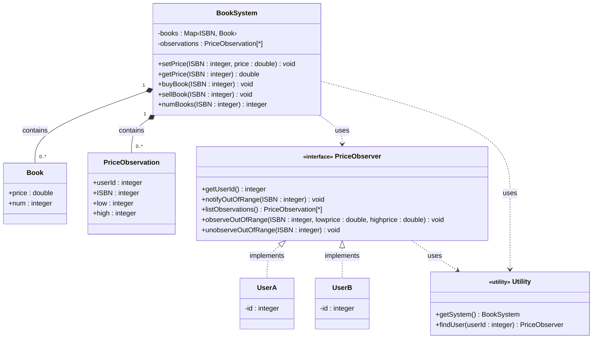
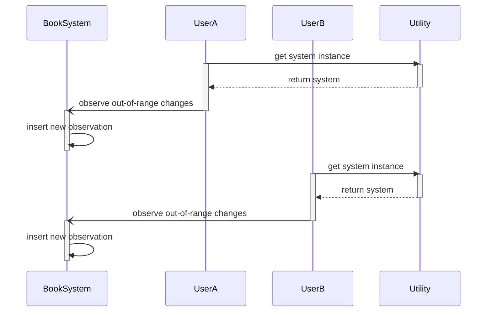
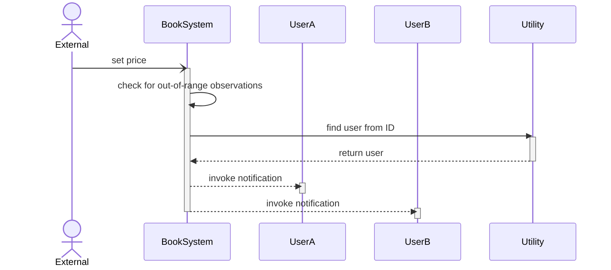
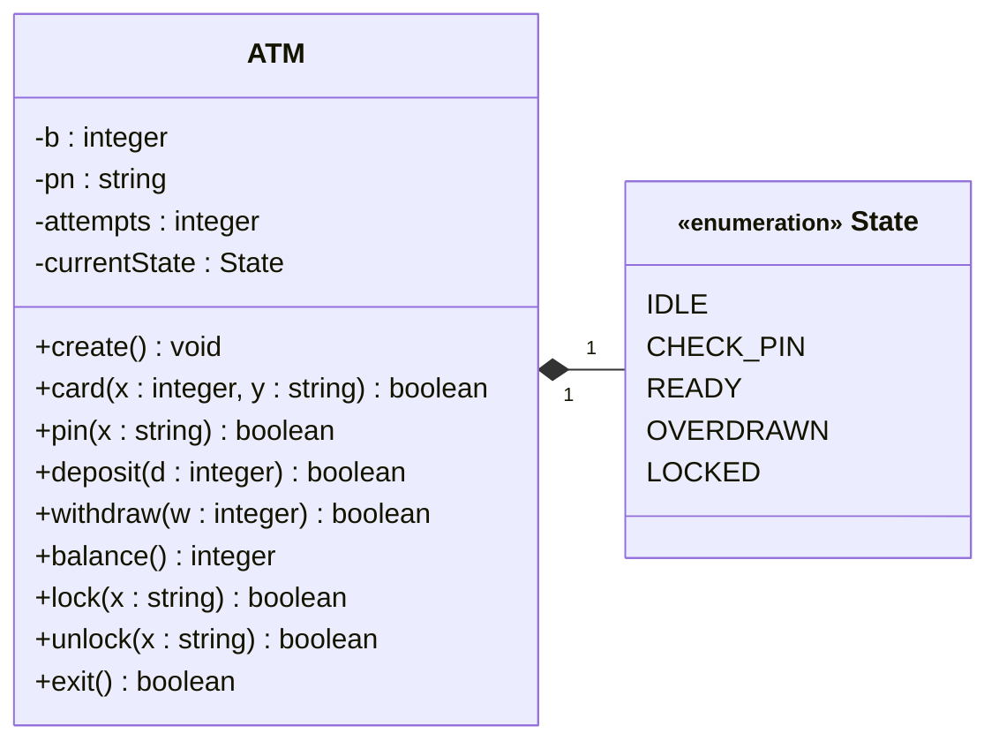
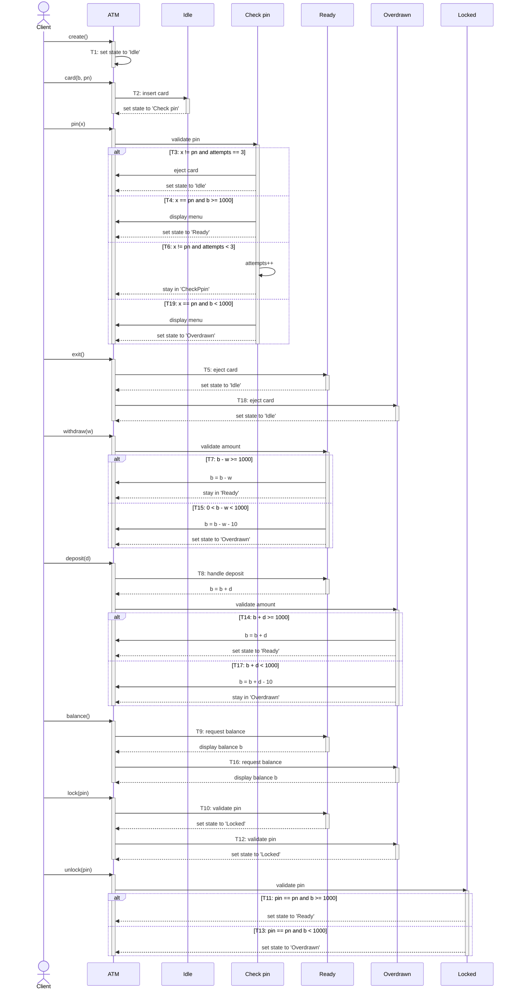

# [Homework 1](https://github.com/hanggrian/IIT-CS586/blob/assets/assignments/hw1_1.pdf)

> For each solution:
>
> 1.  Provide a class diagram for the system. For each class, list all
      operations with parameters and specify them using **pseudo-code.** In
      addition, for each class, provide its attributes and data structures. Make
      the necessary assumptions for your design.
> 1.  Provide a **sequence diagram** for the following operation sequence:
>
>     ```
>     create(), card(1100, "xyz"), pin("xyz"), deposit(300), withdraw(500), exit()
>     ```
>
>     When the EFSM model is "executed" on this sequence of operations, the
      following sequence of transitions is traversed/executed: T<sub>1</sub>,
      T<sub>2</sub>, T<sub>4</sub>, T<sub>8</sub>, T<sub>15</sub>,
      T<sub>18</sub>

## Problem 1

> In the system, there exists a class *BookSystem* which keeps track of prices
  of books in the Book Market. This class supports the following operations:
  `setPrice(ISBN, price)`, `getPrice(ISBN)`, `buyBook(ISBN)`, `sellBook(ISBN)`,
  and `numBooks(ISBN)`. The `setPrice(price, ISBN)` operation sets a new price
  for the book uniquely identified by *ISBN.* The `getPrice(ISBN)` operation
  returns the current price of the book identified by *ISBN.* The
  `buyBook(ISBN)` operation is used to buy a book identified *by ISBN.* The
  `sellBook(ISBN)` operation is used to sell a book identified by *ISBN.* The
  operation `numBooks(ISBN)` returns the number of copies of a book identified
  by ISBN that are available in the system. Notice that each book is uniquely
  identified by *ISBN.*
>
> In addition, there exist user components in the system (e.g., *UserA, UserB,*
  etc.) that are interested in watching the changes in book prices, especially,
  they are interested in watching the out-of-range book price changes.
  Specifically, interested users may register with the system to be notified
  when the price of the book of interest falls outside of the specified price
  range. During registration, the user needs to provide the boundaries
  (*lowprice, highprice*) for the price range for the specific book, where
  *lowprice* is the lower book price and *highprice* is the upper book price of
  the price range. At any time, users may un-register when they are not
  interested in watching the out-of-range book price changes of a specific book.
  Each time the price of a book changes, the system notifies all registered
  users (for which the new book price is outside of the specified price range)
  about the out-of-range book price change. Notice that if the book price change
  is within the specified price range for a given user, this user is not
  notified about this price change.
>
> ```mermaid
> classDiagram
>   class BookSystem {
>     -List&lt;ISBN, price, num&gt;
>     +setPrice()
>     +getPrice()
>     +buyBook()
>     +sellBook()
>     +numBooks()
>   }
>   class UserA {
>     +showPrice()
>   }
>   class UserB {
>     +showPrice()
>   }
> ```
>
> Design the system using the **Observer pattern.** Provide a class diagram for
  the system that should include classes *BookSystem, UserA, and UserB* (if
  necessary, introduce new classes and operations). In your design, it should be
  easy to introduce new types of user components (e.g., *UserC*) that are
  interested in observing the changing prices of books. Notice that the
  components in your design should be decoupled as much as possible. In
  addition, components should have high cohesion.
>
> **In your solution:**
>
> 1.  Provide a class diagram for the system. For each class, list all
      operations with parameters and specify them using **pseudo-code.** In
      addition, for each class, provide its attributes/data structures. Make the
      necessary assumptions for your design.
>
> 1.  Provide two **sequence diagrams** showing:
>
>     - How components *UserA* and *UserB* register to be notified about the
        out-of-range book price change.
>     - How the system notifies the registered user components about the
        out-of-range book price change.

### Class diagram

There are simple data classes `Book` and `PriceObservation` that are used in the
system’s data structure. To share the same attributes, an interface
`PriceObserver` is shared among user components to listen for out-of-range price
changes made in the system. Finally, Utility is a singleton object with only
static methods.



#### Pseudo-code

The book inventory is maintained as a map (or dictionary) for efficient ISBN
retrieval. The price observations, on the other hand, are kept in a dynamic-size
array (or list). The utility class is referred to when implementing the observer
pattern in the pseudocode, but the class itself is not defined.

```vb
class Book {
  double price
  integer num
}

class PriceObservation {
  integer userId
  integer isbn
  double low
  double high
}

class BookSystem {
  Map<Integer, Book> books 'dictionary of ISBN to inventory'
  PriceObservation[*] observations 'list of dynamic size'

  void setPrice(integer isbn, double price) {
    IF price < 0 THEN
      THROW ERROR
    END IF
    FOR PriceObservation observation IN observations THEN
      IF observation.isbn -> isbn THEN
        CONTINUE
      END IF
      IF observation.lowprice <= price AND price <= observation.highprice THEN
        CONTINUE
      END IF
      PriceObserver user <- Utility.findUser(observation.userId)
      user.notifyOutOfRange()
    END FOR
    Book current -> books[ISBN]
    current.price -> price
    books[isbn] -> current
  }

  double getPrice(integer isbn) {
    Book current -> books[ISBN]
    RETURN current.price
  }

  void buyBook(integer isbn) {
    Book current -> books[ISBN]
    IF NOT current -> null THEN
      current.num -> current.num + 1
      books[isbn] -> current
      RETURN
    END IF
    Book addition
    addition.price -> MAX_VALUE
    addition.num -> 1
    books[isbn] -> addition
  }

  void sellBook(integer isbn) {
    Book current -> books[ISBN]
    IF current -> null OR current < 1 THEN
      THROW ERROR
    END IF
    IF current > 1 THEN
      current.num -> current.num - 1
      books[isbn] -> current
      RETURN
    END IF
    books -> books - current 'by removing key'
  }

  integer numBooks(integer isbn) {
    Book current -> books[ISBN]
    RETURN current.num
  }
}

interface PriceObserver {
  integer getUserId()

  void notifyOutOfRange(integer isbn)

  List<PriceObservation> listObservations() {
    BookSystem system -> Utility.getSystem()
    PriceObservation[*] observations -> system.observations
    PriceObservation[*] result
    FOR PriceObservation observation IN OBSERVATIONS THEN
      IF observation.isbn -> getUserId() THEN
        result -> result + observation
      END IF
    END FOR
    RETURN result
  }

  void observeOutOfRange(integer isbn, double lowprice, double highprice) {
    IF lowprice < highprice THEN
      THROW ERROR
    END IF
    BookSystem system -> Utility.getSystem()
    PriceObservation[*] observations -> system.observations
    PriceObservation addition
    addition.userId -> getUserId()
    addition.isbn -> isbn
    addition.low -> lowprice
    addition.high -> highprice
    observations -> observations + addition
  }

  void unobserveOutOfRange(integer isbn) {
    BookSystem system -> Utility.getSystem()
    PriceObservation[*] observations -> system.observations
    FOR PriceObservation observation IN observations THEN
      IF observation.userId -> getUserId() AND observation.isbn -> isbn THEN
        observations -> observations - observation
      END IF
    END FOR
  }
}

class UserA implements PriceObserver {
  integer id

  integer getUserId() {
    RETURN id
  }

  void notifyOutRange(integer isbn) {
    'implementation to alert user of price changes'
  }
}

class UserB implements PriceObserver {
  'similar implementation with UserA'
}
```

### Sequence diagrams

#### Subscribing observations

Users can subscribe to receive notifications about out-of-range price changes
for their selected movies. First, users call the singleton instance of the
system using the utility class. Then, inserts a new observation preference (ISBN
& price range) into the existing list with dynamic size.



#### Notifying observers

The system waits for any price change made to book inventory. When a price
modification is detected, it iterates the observation list to find a matching
ISBN where the changed price doesn’t match the preferred range. Like user
components, the book system relies on the utility class to find the user
instance to trigger the `notifyOutOfRange()` method.



## Problem 2

> The ATM component supports the following operations:
>
> ```java
> create()              // ATM is created
> card(int x, string y) // ATM card is inserted where x is a balance and y is a pin #
> pin(String x)         // provides pin #
> deposit(int d)        // deposit amount d
> withdraw(int w)       // withdraw amount w
> balance()             // display the current balance
> lock(String x)        // lock the ATM, where x is a pin #
> unlock(String x)      // unlock the ATM, where x is pin #
> exit()                // exit from the ATM
> ```
>
> A simplified EFSM model for the ATM component is shown on the next page.
>
> ```mermaid
> ---
> config:
>   flowchart:
>     defaultRenderer: "elk"
> ---
> flowchart LR
>   Start("Start") --T<sub>1</sub>--> Idle
>   Idle --T<sub>2</sub>--> CheckPin["Check pin"]
>   CheckPin --T<sub>3</sub>--> Idle
>   CheckPin --T<sub>4</sub>--> Ready
>   Ready --T<sub>5</sub>--> Idle
>   CheckPin --T<sub>6</sub>--> CheckPin
>   Ready --T<sub>7</sub>--> Ready
>   Ready --T<sub>8</sub>--> Ready
>   Ready --T<sub>9</sub>--> Ready
>   Ready --T<sub>10</sub>--> Locked
>   Locked --T<sub>11</sub>--> Ready
>   Overdrawn --T<sub>12</sub>--> Locked
>   Locked --T<sub>13</sub>--> Overdrawn
>   Overdrawn --T<sub>14</sub>--> Ready
>   Ready --T<sub>15</sub>--> Overdrawn
>   Overdrawn --T<sub>16</sub>--> Overdrawn
>   Overdrawn --T<sub>17</sub>--> Overdrawn
>   Overdrawn --T<sub>18</sub>--> Idle
>   CheckPin --T<sub>19</sub>--> Overdrawn
> ```
>
> Step | Operation
> ---: | ---
> T<sub>1</sub> | `create()`
> T<sub>2</sub> | `card(x, y) / b = x`<br>`pn = y`<br>`attempts = 0`
> T<sub>3</sub> | `pin(x)[(x != pn) && (attempts == 3)] / eject card`
> T<sub>4</sub> | `pin(x)[(x == pn) && (b >= 1000)] / display menu`
> T<sub>5</sub> | `exit / eject card`
> T<sub>6</sub> | `pin(x)[(x != pn) && (attempts < 3)] / attempts++`
> T<sub>7</sub> | `withdraw(x)[b - w >= 1000] / b = b - w`
> T<sub>8</sub> | `deposit(d) / b = b + d`
> T<sub>9</sub> | `balance()`<br>`display balance b`
> T<sub>10</sub> | `lock(x)[x == pn]`
> T<sub>11</sub> | `unlock(x)[(x == pn) && (b >= 1000)]`
> T<sub>12</sub> | `lock(x)[x == pn]`
> T<sub>13</sub> | `unlock(x)[(x == pn) && (b < 1000)]`
> T<sub>14</sub> | `deposit(d)[b + d >= 1000] / b = b + d`
> T<sub>15</sub> | `withdraw(w)[(b - w < 1000) && (b - w > 0)] / b = b - w - 10`
> T<sub>16</sub> | `balance / display balance b`
> T<sub>17</sub> | `deposit(d)[b + d < 1000] / b = b + d - 10`
> T<sub>18</sub> | `exit / eject card`
> T<sub>19</sub> | `pin(x)[(x == pn) && (b < 1000)] / display menu`
>
> A simplified EFSM model for the *ATM* component is shown on the next page.
>
> Design the system using the **State design pattern.** Provide two solutions:
>
> - **a decentralized** version of the State pattern
> - **a centralized** version of the State pattern
>
> Notice that the components in your design should be **decoupled** as much as
  possible. In addition, components should have high **cohesion.**

### Class diagram

The class diagram and pseudo-code below use **a centralized** version. Each
entry in the `State` enumeration represents a node defined in the EFSM of ATM.
In addition to all methods declared in the problem statement, the `ATM` holds an
additional state property to keep track of the current ATM phase.



#### Pseudo-code

Most functions (all except `create()` and `balance()`) return a Boolean value
indicating whether the intended operation was executed successfully. For
example, `card(x, y)` will always yield false when the ATM is not idle. However,
the pseudo-code is not complete because there are a few undeclared operations,
such as ejecting the card and displaying the menu.

```vb
enum State {
  IDLE
  CHECK_PIN
  READY
  OVERDRAWN
  LOCKED
}

class ATM {
  integer b
  string pn
  integer attempts
  State currentState

  void create() {
    'T1'
    currentState -> IDLE
  }

  boolean card(integer x, string y) {
    IF NOT currentState -> IDLE THEN
      RETURN FALSE
    END IF
    'T2'
    b -> x
    pn -> y
    attempts -> 0
    currentState -> CHECK_PIN
    RETURN TRUE
  }

  boolean pin(string x) {
    IF NOT currentState -> CHECK_PIN THEN
      RETURN FALSE
    END IF
    'T3'
    IF NOT x -> pn AND attempts == 3 THEN
      'eject card'
      currentState -> IDLE
      RETURN TRUE
    'T4'
    ELSE IF x -> pn AND b >= 1000 THEN
      'display menu'
      currentState -> READY
      RETURN TRUE
    'T6'
    ELSE NOT x -> pn AND attempts < 3 THEN
      attempts -> attempts + 1
      currentState -> CHECK_PIN
      RETURN TRUE
    'T19'
    ELSE IF x -> pn AND b < 1000 THEN
      'display menu'
      currentState -> OVERDRAWN
      RETURN TRUE
    END IF
    RETURN FALSE
  }

  boolean deposit(integer d) {
    'T8'
    IF currentState -> READY THEN
      b -> b + d
      currentState -> READY
      RETURN TRUE
    END IF
    IF NOT currentState -> OVERDRAWN THEN
      RETURN FALSE
    END IF
    'T14'
    IF b + d >= 1000 THEN
      b -> b + d
      currentState -> READY
    'T17'
    ELSE
      b -> b + d - 10
      currentState -> OVERDRAWN
    END IF
    RETURN TRUE
  }

  boolean withdraw(integer w) {
    IF NOT currentState -> READY THEN
      RETURN FALSE
    END IF
    'T7'
    IF b - w >= 1000 THEN
      b -> b - w
      currentState -> READY
      RETURN TRUE
    'T15'
    ELSE IF b - w > 0 AND b - w < 1000 THEN
      b -> b - w - 10
      currentState -> OVERDRAWN
      RETURN TRUE
    END IF
    RETURN FALSE
  }

  integer balance() {
    IF NOT currentState -> READY AND NOT currentState -> OVERDRAWN THEN
      RETURN -1
    END IF
    'T9,T16'
    RETURN b
  }

  boolean lock(string x) {
    IF NOT currentState -> READY AND NOT currentState -> OVERDRAWN THEN
      RETURN FALSE
    END IF
    IF NOT x -> pn THEN
      RETURN FALSE
    END IF
    'T10,T12'
    currentState -> LOCKED
    RETURN TRUE
  }

  boolean unlock(string x) {
    IF NOT currentState -> LOCKED OR NOT x -> pn THEN
      RETURN FALSE
    END IF
    'T11'
    IF b >= 1000 THEN
      currentState -> READY
    'T13'
    ELSE
      currentState -> OVERDRAWN
    END IF
    RETURN TRUE
  }

  boolean exit() {
    IF NOT currentState -> READY AND NOT currentState -> OVERDRAWN THEN
      RETURN FALSE
    END IF
    'T5,T18'
    'eject card'
    currentState -> IDLE
    RETURN TRUE
  }
}
```

### Sequence diagrams

#### Decentralized pattern

A class is created for every state (idle, checking pin, etc.) in the
decentralized version. Because they may share the same attributes, the states
implement an interface that will be kept as a property in the ATM class. The
implementation of those attributes, such as `deposit(d)` and `withdraw(w)`, is
different in each state.



#### Centralized pattern

In the centralized solution, the ATM keeps track of the current phase by storing
a state property in enumeration form. As opposed to a custom implementation in
each separate class, the main class relies on conditional state checks in its
method statements. Other than that, the operations and their notation are
comparable to the decentralized state pattern.

```mermaid
sequenceDiagram
  actor Client
  participant ATM
  participant State

  Client ->> ATM: create()
  activate ATM
  ATM ->> State: T1: create ATM
  activate State
  State -->> ATM: set state to 'Idle'
  deactivate State
  deactivate ATM

  Client ->> ATM: card(b, pn)
  activate ATM
  ATM ->> State: T2: insert card
  activate State
  State -->> ATM: set state to 'CheckPin'
  deactivate State
  deactivate ATM

  Client ->> ATM: pin(x)
  activate ATM
  ATM ->> State: validate pin
  activate State
  alt T3: x != pn and attempts == 3
    State ->> ATM: eject card
    State -->> ATM: set state to 'Idle'
  else T4: x == pn and b >= 1000
    State ->> ATM: display menu
    State -->> ATM: set state to 'Ready'
  else T6: x != pn and attempts < 3
    State ->> State: attempts++
    State -->> ATM: set state to 'CheckPin'
  else T19: x == pn and b < 1000
    State ->> ATM: display menu
    State -->> ATM: set state to 'Overdrawn'
  end
  deactivate State
  deactivate ATM

  Client ->> ATM: exit()
  activate ATM
  ATM ->> State: prepare exit
  activate State
  alt T5: from 'Ready'
    State ->> ATM: eject card
    State -->> ATM: set state to 'Idle'
  else T18: from 'Overdrawn'
    State ->> ATM: eject card
    State -->> ATM: set state to 'Idle'
  end
  deactivate State
  deactivate ATM

  Client ->> ATM: withdraw(w)
  activate ATM
  ATM ->> State: validate amount
  activate State
  alt T7: b - w >= 1000
    State ->> ATM: b = b - w
    State -->> ATM: set state to 'Ready'
  else T15: 0 < b - w < 1000
    State ->> ATM: b = b - w - 10
    State -->> ATM: set state to 'Overdrawn'
  end
  deactivate State
  deactivate ATM

  Client ->> ATM: deposit(d)
  activate ATM
  ATM ->> State: validate amount
  activate State
  alt T8: from Ready
    State ->> ATM: b = b + d
    State -->> ATM: set state to 'Ready'
  else T14: from 'Overdrawn', b + d >= 1000
    State ->> ATM: b = b + d
    State -->> ATM: set state to 'Ready'
  else T17: from 'Overdrawn', b + d < 1000
    State ->> ATM: b = b + d - 10
    State -->> ATM: set state to 'Overdrawn'
  end
  deactivate State
  deactivate ATM

  Client ->> ATM: balance()
  activate ATM
  ATM ->> State: request balance
  activate State
  alt T9: from 'Ready'
    State ->> ATM: display balance b
    State -->> ATM: set state to 'Ready'
  else T16: from 'Overdrawn'
    State ->> ATM: display balance b
    State -->> ATM: set state to 'Overdrawn'
  end
  deactivate State
  deactivate ATM

  Client ->> ATM: lock(pin)
  activate ATM
  ATM ->> State: validate pin
  activate State
  alt T10: from 'Ready', pin == pn
    State -->> ATM: set state to 'Locked'
  else T12: from 'Overdrawn', pin == pn
    State -->> ATM: set state to 'Locked'
  end
  deactivate State
  deactivate ATM

  Client ->> ATM: unlock(pin)
  activate ATM
  ATM ->> State: validate pin
  activate State
  alt T11: pin == pn and b >= 1000
    State -->> ATM: set state to 'Ready'
  else T13: pin == pn and b < 1000
    State -->> ATM: set state to 'Overdrawn'
  end
  deactivate State
  deactivate ATM
```


