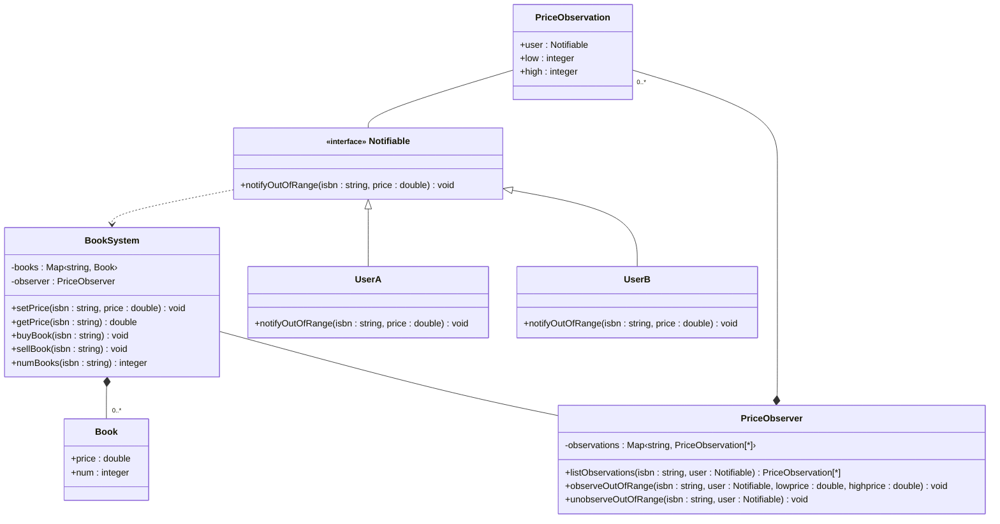
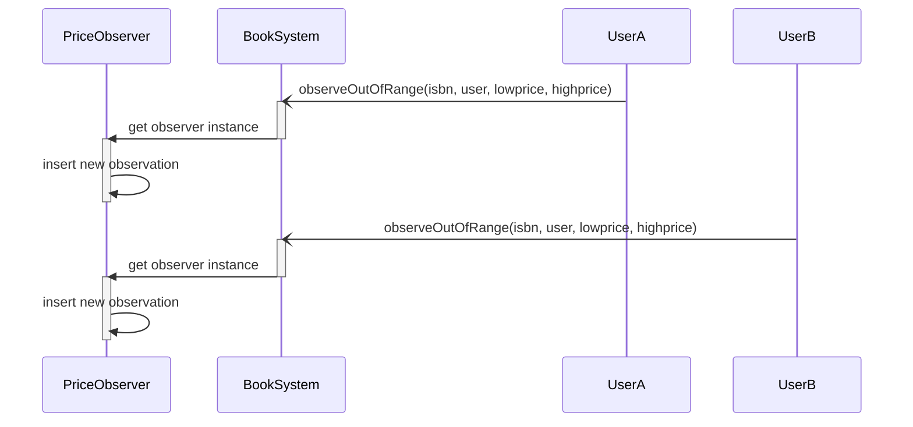
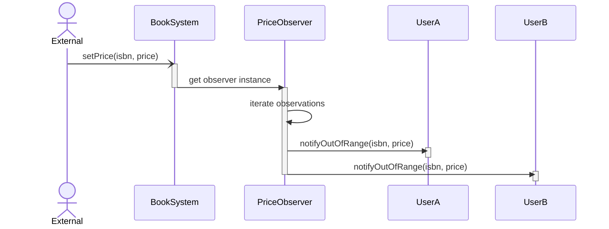
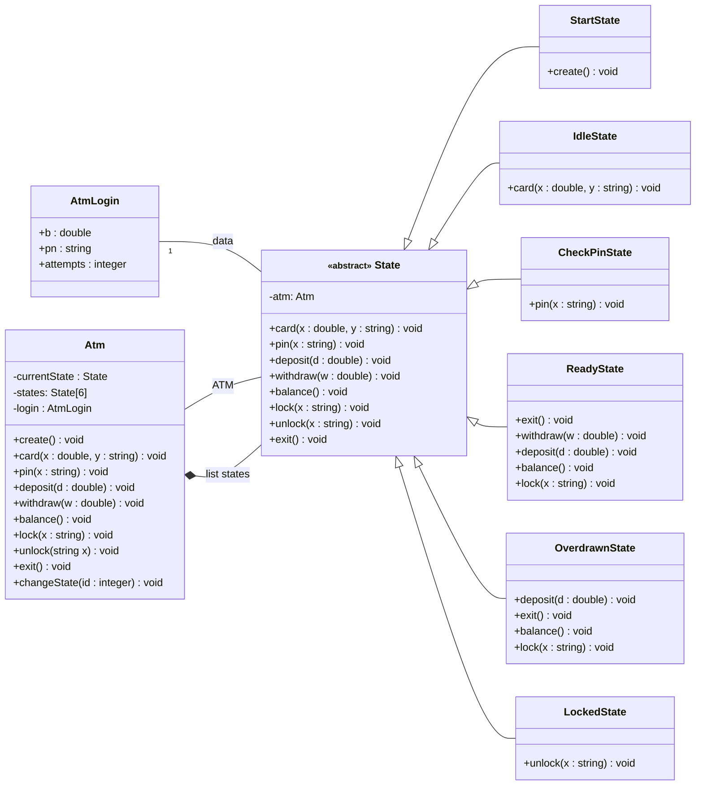
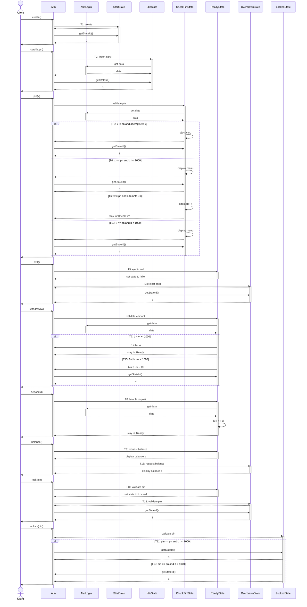
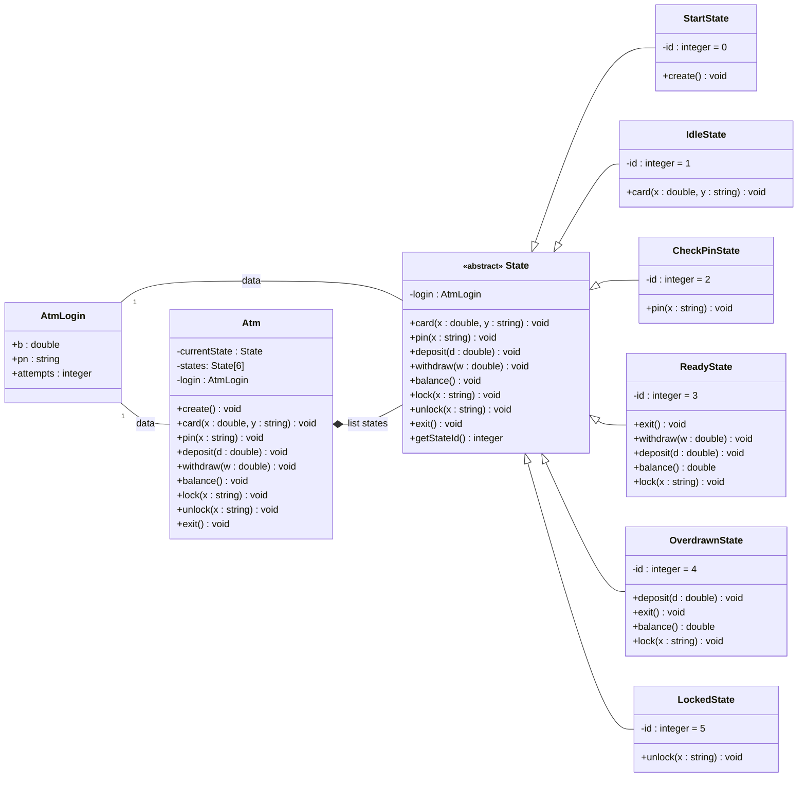
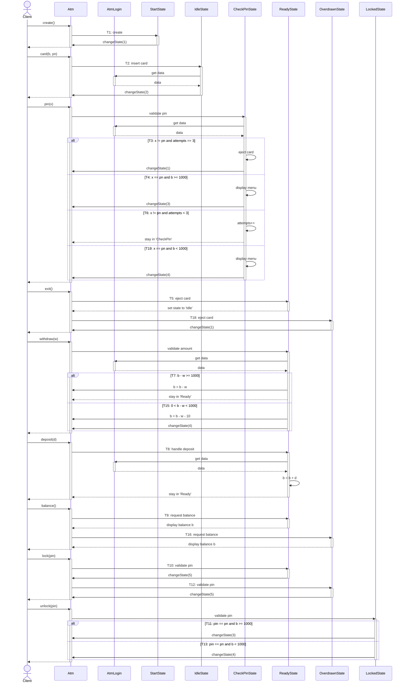

<!-- KaTeX -->
<script
  type="text/javascript"
  src="http://cdn.mathjax.org/mathjax/latest/MathJax.js?config=TeX-AMS-MML_HTMLorMML">
</script>
<script
  type="text/x-mathjax-config">
  MathJax.Hub.Config({tex2jax: {inlineMath: [['$','$'], ['\\(','\\)']]}});
</script>

# [Homework 1](https://github.com/hanggrian/IIT-CS586/blob/assets/assignments/hw1_1.pdf)

> For each solution:
>
> 1.  Provide a class diagram for the system. For each class, list all
      operations with parameters and specify them using **pseudo-code.** In
      addition, for each class, provide its attributes and data structures. Make
      the necessary assumptions for your design.
> 1.  Provide a **sequence diagram** for the following operation sequence:
>
>     ```
>     create(), card(1100, "xyz"), pin("xyz"), deposit(300), withdraw(500), exit()
>     ```
>
>     When the EFSM model is "executed" on this sequence of operations, the
      following sequence of transitions is traversed/executed: $T_1$, $T_2$,
      $T_4$, $T_8$, $T_{15}$, $T_{18}$

## Problem 1

> In the system, there exists a class *BookSystem* which keeps track of prices
  of books in the Book Market. This class supports the following operations:
  `setPrice(ISBN, price)`, `getPrice(ISBN)`, `buyBook(ISBN)`, `sellBook(ISBN)`,
  and `numBooks(ISBN)`. The `setPrice(price, ISBN)` operation sets a new price
  for the book uniquely identified by *ISBN.* The `getPrice(ISBN)` operation
  returns the current price of the book identified by *ISBN.* The
  `buyBook(ISBN)` operation is used to buy a book identified *by ISBN.* The
  `sellBook(ISBN)` operation is used to sell a book identified by *ISBN.* The
  operation `numBooks(ISBN)` returns the number of copies of a book identified
  by ISBN that are available in the system. Notice that each book is uniquely
  identified by *ISBN.*
>
> In addition, there exist user components in the system (e.g., *UserA, UserB,*
  etc.) that are interested in watching the changes in book prices, especially,
  they are interested in watching the out-of-range book price changes.
  Specifically, interested users may register with the system to be notified
  when the price of the book of interest falls outside of the specified price
  range. During registration, the user needs to provide the boundaries
  (*lowprice, highprice*) for the price range for the specific book, where
  *lowprice* is the lower book price and *highprice* is the upper book price of
  the price range. At any time, users may un-register when they are not
  interested in watching the out-of-range book price changes of a specific book.
  Each time the price of a book changes, the system notifies all registered
  users (for which the new book price is outside of the specified price range)
  about the out-of-range book price change. Notice that if the book price change
  is within the specified price range for a given user, this user is not
  notified about this price change.
>
> ```mermaid
> classDiagram
>   class BookSystem {
>     -List&lt;ISBN, price, num&gt;
>     +setPrice()
>     +getPrice()
>     +buyBook()
>     +sellBook()
>     +numBooks()
>   }
>   class UserA {
>     +showPrice()
>   }
>   class UserB {
>     +showPrice()
>   }
> ```
>
> Design the system using the **Observer pattern.** Provide a class diagram for
  the system that should include classes *BookSystem, UserA, and UserB* (if
  necessary, introduce new classes and operations). In your design, it should be
  easy to introduce new types of user components (e.g., *UserC*) that are
  interested in observing the changing prices of books. Notice that the
  components in your design should be decoupled as much as possible. In
  addition, components should have high cohesion.
>
> **In your solution:**
>
> 1.  Provide a class diagram for the system. For each class, list all
      operations with parameters and specify them using **pseudo-code.** In
      addition, for each class, provide its attributes/data structures. Make the
      necessary assumptions for your design.
>
> 1.  Provide two **sequence diagrams** showing:
>
>     - How components *UserA* and *UserB* register to be notified about the
        out-of-range book price change.
>     - How the system notifies the registered user components about the
        out-of-range book price change.

### Class diagram

There are simple data classes `Book` and `PriceObservation` that are used in the
system’s data structure. The implementation of the observer pattern is decoupled
in a separate class, `PriceObserver`. To share the same attributes, an interface
`Notifiable` is shared among user components to listen for out-of-range price
changes made in the system.



### Pseudo-code

The book inventory and price observations are maintained as maps (or
dictionaries) for efficient retrieval by ISBN. In the observer pattern
implementation, the value of this map is a dynamically-sized array (or list).
The operation to find a book in inventory is $O(1)$, while traversing
observations to find a matching user is $O(n)$ for every price change.

```vb
class Book {
  double price
  integer num
}

class PriceObservation {
  Notifiable user
  double low
  double high
}

class BookSystem {
  Map<string, Book> books
  PriceObserver observer

  'Modify a book price and notify users of any out-of-range price change.'
  void setPrice(string isbn, double price) {
    IF price < 0 THEN
      THROW ERROR
    END IF
    Map<string, PriceObservation[*]> observations <- observer.observations
    PriceObservation[*] os <- observations[isbn]
    FOR PriceObservation o IN os THEN
      IF o.isbn == isbn THEN
        CONTINUE
      END IF
      IF o.lowprice <= price AND
        price <= o.highprice THEN
        CONTINUE
      END IF
      Notifiable u <- o.user
      u.notifyOutOfRange()
    END FOR
    Book b <- books[ISBN]
    b.price <- price
    books[isbn] <- b
  }

  'Returns the book price.'
  double getPrice(string isbn) {
    Book b <- books[ISBN]
    RETURN b.price
  }

  'Increment a book count, or insert new item in case of a new inventory.'
  void buyBook(string isbn) {
    Book b <- books[ISBN]
    IF b != null THEN
      b.num <- b.num + 1
      books[isbn] <- b
      RETURN
    END IF
    Book b2
    b2.price <- MAX_VALUE
    b2.num <- 1
    books[isbn] <- b2
  }

  'Reduce a book count, or error when current count is non-positive.'
  void sellBook(string isbn) {
    Book b <- books[ISBN]
    IF b == null OR current < 1 THEN
      THROW ERROR
    END IF
    IF b > 1 THEN
      b.num <- b.num - 1
      books[isbn] <- b
      RETURN
    END IF
    books <- books - b 'by removing key'
  }

  'Count available books given ISBN.'
  integer numBooks(string isbn) {
    Book b <- books[ISBN]
    RETURN b.num
  }
}

class PriceObserver {
  Map<string, PriceObservation[*]> observations

  'List user observations of any book.'
  PriceObservation[*] listObservations(string isbn, Notifiable user) {
    PriceObservation[*] result
    FOR (string isbn, PriceObservation[*] os) IN observations THEN
      FOR PriceObservation o IN os THEN
        IF o.user == user THEN
          result <- result + o
        END IF
      END FOR
    END FOR
    RETURN result
  }

  'Register to listen to price changes, multiple price range of the same book'
  'is allowed.'
  void observeOutOfRange(
    string isbn,
    Notifiable user,
    double lowprice,
    double highprice
  ) {
    IF lowprice < highprice THEN
      THROW ERROR
    END IF
    PriceObservation o
    o.user <- user
    o.low <- lowprice
    o.high <- highprice
    observations[isbn] <- observations[isbn] + o
  }

  'Removes all book observations by ISBN assigned to this user.'
  void unobserveOutOfRange(string isbn, Notifiable user) {
    PriceObservation[*] os <- observations[isbn]
    FOR PriceObservation o IN os THEN
      IF o.user == user AND o.isbn == isbn THEN
        o <- os - o
      END IF
    END FOR
  }
}

interface Notifiable {
  'Abstract method that will be triggered upon price change.'
  void notifyOutOfRange(string isbn, double price)
}

class UserA implements Notifiable {
  void notifyOutOfRange(string isbn, double price) {
    'TODO: custom implementation.'
  }
}

class UserB implements Notifiable {
  void notifyOutOfRange(string isbn, double price) {
    'TODO: custom implementation.'
  }
}
```

### Sequence diagrams

#### Subscribing observations

Users can subscribe to receive notifications about out-of-range price changes
for their selected movies. After invoking an observation method, the book system
calls upon a price observer instance and finds a list of observations given a
book's ISBN. Then, inserts a new observation preference into the existing list.



#### Notifying observers

The system waits for any price change made to book inventory. When a price
modification is detected, it iterates the observation list to find a matching
ISBN where the changed price doesn't match the preferred range. It then invokes
the abstract `notifyOutOfRange()`, which may differ from component to component.



## Problem 2

> The ATM component supports the following operations:
>
> ```vb
> create()                  'ATM is created'
> card(integer x, string y) 'ATM card is inserted where x is a balance and y is a pin #'
> pin(string x)             'provides pin #'
> deposit(integer d)        'deposit amount d'
> withdraw(integer w)       'withdraw amount w'
> balance()                 'display the current balance'
> lock(string x)            'lock the ATM, where x is a pin #'
> unlock(string x)          'unlock the ATM, where x is pin #'
> exit()                    'exit from the ATM'
> ```
>
> A simplified EFSM model for the ATM component is shown on the next page.
>
> ```mermaid
> ---
> config:
>   flowchart:
>     defaultRenderer: "elk"
> ---
> flowchart LR
>   Start -- T<sub>1</sub> --> Idle
>   Idle -- T<sub>2</sub> --> CheckPin[Check pin]
>   CheckPin -- T<sub>3</sub> --> Idle
>   CheckPin -- T<sub>4</sub> --> Ready
>   Ready -- T<sub>5</sub> --> Idle
>   CheckPin -- T<sub>6</sub> --> CheckPin
>   Ready -- T<sub>7</sub> --> Ready
>   Ready -- T<sub>8</sub> --> Ready
>   Ready -- T<sub>9</sub> --> Ready
>   Ready -- T<sub>10</sub> --> Locked
>   Locked -- T<sub>11</sub> --> Ready
>   Overdrawn -- T<sub>12</sub> --> Locked
>   Locked -- T<sub>13</sub> --> Overdrawn
>   Overdrawn -- T<sub>14</sub> --> Ready
>   Ready -- T<sub>15</sub> --> Overdrawn
>   Overdrawn -- T<sub>16</sub> --> Overdrawn
>   Overdrawn -- T<sub>17</sub> --> Overdrawn
>   Overdrawn -- T<sub>18</sub> --> Idle
>   CheckPin -- T<sub>19</sub> --> Overdrawn
> ```
>
> Step | Operation
> ---: | ---
> $T_1$ | `create()`
> $T_2$ | `card(x, y) / b = x`<br>`pn = y`<br>`attempts = 0`
> $T_3$ | `pin(x)[(x != pn) && (attempts == 3)] / eject card`
> $T_4$ | `pin(x)[(x == pn) && (b >= 1000)] / display menu`
> $T_5$ | `exit / eject card`
> $T_6$ | `pin(x)[(x != pn) && (attempts < 3)] / attempts++`
> $T_7$ | `withdraw(x)[b - w >= 1000] / b = b - w`
> $T_8$ | `deposit(d) / b = b + d`
> $T_9$ | `balance()`<br>`display balance b`
> $T_{10}$ | `lock(x)[x == pn]`
> $T_{11}$ | `unlock(x)[(x == pn) && (b >= 1000)]`
> $T_{12}$ | `lock(x)[x == pn]`
> $T_{13}$ | `unlock(x)[(x == pn) && (b < 1000)]`
> $T_{14}$ | `deposit(d)[b + d >= 1000] / b = b + d`
> $T_{15}$ | `withdraw(w)[(b - w < 1000) && (b - w > 0)] / b = b - w - 10`
> $T_{16}$ | `balance / display balance b`
> $T_{17}$ | `deposit(d)[b + d < 1000] / b = b + d - 10`
> $T_{18}$ | `exit / eject card`
> $T_{19}$ | `pin(x)[(x == pn) && (b < 1000)] / display menu`
>
> A simplified EFSM model for the *ATM* component is shown on the next page.
>
> Design the system using the **State design pattern.** Provide two solutions:
>
> - **a decentralized** version of the State pattern
> - **a centralized** version of the State pattern
>
> Notice that the components in your design should be **decoupled** as much as
  possible. In addition, components should have high **cohesion.**

### Decentralized version

#### Class diagram



#### Pseudo-code

```vb
class AtmLogin {
  double b
  string pn
  integer attempts
}

class Atm {
  State currentState
  State[6] states

  Atm() {
    states[0] <- new StartState()
    states[1] <- new IdleState()
    states[2] <- new CheckPinState()
    states[3] <- new ReadyState()
    states[4] <- new OverdrawnState()
    states[5] <- new LockedState()
    currentState <- states[0]
  }

  void create() {
    currentState.create()
  }

  void card(double x, string y) {
    currentState.card(x, y)
  }

  void pin(string x) {
    currentState.pin(x)
  }

  void deposit(double d) {
    currentState.deposit(d)
  }

  void withdraw(double w) {
    currentState.withdraw(w)
  }

  void balance() {
    currentState.balance()
  }

  void lock(string x) {
    currentState.lock(x)
  }

  void unlock(string x) {
    currentState.unlock(x)
  }

  void exit() {
    currentState.exit()
  }

  void changeState(integer id) {
    currentState <- states[id]
  }
}

abstract class State {
  Atm atm
  AtmLogin login

  abstract void card(double x, string y)

  abstract void pin(string x)

  abstract void deposit(double d)

  abstract void withdraw(double w)

  abstract void balance()

  abstract void lock(string x)

  abstract void unlock(string x)

  abstract void exit()
}

class StartState implements State {
  integer id <- 0

  void create() {
    'T1'
  }
}

class IdleState implements State {
  integer id <- 1

  void card(double x, string y) {
    'T2'
    login.b <- x
    login.pn <- y
    login.attempts <- 0
  }
}

class CheckPinState implements State {
  integer id <- 2

  void pin(string x) {
    'T3'
    IF x != pn AND attempts == 3 THEN
      'eject card'
    'T4'
    ELSE IF x == pn AND b >= 1000 THEN
      'display menu'
    'T6'
    ELSE IF x != pn AND attempts < 3 THEN
      attempts <- attempts + 1
    'T19'
    ELSE IF x == pn AND b < 1000 THEN
      'display menu'
    END IF
  }
}

class ReadyState implements State {
  integer id <- 3

  void deposit(double d) {
    'T8'
    login.b <- login.b + d
  }

  void withdraw(double w) {
    'T7'
    IF login.b - w >= 1000 THEN
      login.b <- login.b - w
    'T15'
    ELSE IF login.b - w > 0 AND login.b - w < 1000 THEN
      login.b <- login.b - w - 10
    END IF
  }

  void balance() {
    'T9'
    'Display balance b'
  }

  void lock(string x) {
    'T10'
    IF NOT x == pn THEN
      RETURN
    END IF
  }

  void exit() {
    'T5'
    'eject card'
  }
}

class OverdrawnState implements State {
  integer id <- 4

  void deposit(double d) {
    'T14'
    IF login.b + d >= 1000 THEN
      login.b <- login.b + d
    'T17'
    ELSE
      login.b <- login.b + d - 10
    END IF
  }

  void balance() {
    'T16'
    'Display balance b'
  }

  void lock(string x) {
    'T12'
    IF x != pn THEN
      RETURN
    END IF
    atm.changeState(5)
  }

  void exit() {
    'T18'
    'eject card'
    atm.changeState(1)
  }
}

class LockedState implements State {
  integer id <- 5

  void unlock(string x) {
    IF x != pn THEN
      RETURN
    END IF
    'T11'
    IF login.b >= 1000 THEN
    'T13'
    ELSE
    END IF
  }
}
```

#### Sequence diagram



### Centralized version

#### Class diagram



#### Pseudo-code

```vb
class AtmLogin {
  double b
  string pn
  integer attempts
}

class Atm {
  State currentState
  State[6] states
  AtmLogin login

  Atm() {
    states[0] <- new StartState()
    states[1] <- new IdleState()
    states[2] <- new CheckPinState()
    states[3] <- new ReadyState()
    states[4] <- new OverdrawnState()
    states[5] <- new LockedState()
    currentState <- states[0]
  }

  void create() {
    currentState.create()
    IF currentState.getStateId() == 0 THEN
      currentState <- states[1]
    END IF
  }

  void card(double x, string y) {
    currentState.card(x, y)
    IF currentState.getStateId() == 1 THEN
      currentState <- states[2]
    END IF
  }

  void pin(string x) {
    integer attempts <- login.attempts
    currentState.pin(x)
    IF currentState.getStateId() == 2 THEN
      IF x != login.pn AND attempts == 3 THEN
        currentState <- states[1]
      ELSE IF x == login.pn AND login.b >= 1000 THEN
        currentState <- states[3]
      ELSE IF x == login.pn AND login.b < 1000 THEN
        currentState <- states[4]
      END IF
    END IF
  }

  void deposit(double d) {
    double temp = login.b
    currentState.deposit(d)
    IF currentState.getStateId() == 4 THEN
      IF temp + d >= 1000 THEN
        currentState <- states[3]
      END IF
    END IF
  }

  void withdraw(double w) {
    double temp = login.b
    currentState.withdraw(w)
    IF currentState.getStateId() == 3 THEN
      IF temp - w < 1000 AND temp - w > 0 THEN
        currentState <- states[4]
      ELSE IF temp - w >= 1000 THEN
        // no change
      END IF
    END IF
  }

  void balance() {
    currentState.balance()
  }

  void lock(string x) {
    currentState.lock(x)
    IF currentState.getStateId() == 3 OR currentState.getStateId() == 4 THEN
      IF x == login.pn THEN
        currentState <- states[5]
      END IF
    END IF
  }

  void unlock(string x) {
    currentState.unlock(x)
    IF currentState.getStateId() == 5 THEN
      IF x == login.pn AND login.b >= 1000 THEN
        currentState <- states[3]
      ELSE IF x == login.pn AND login.b < 1000 THEN
        currentState <- states[4]
      END IF
    END IF
  }

  void exit() {
    currentState.exit()
    IF currentState.getStateId() == 3 OR currentState.getStateId() == 4 THEN
      currentState <- states[1]
    END IF
  }
}

abstract class State {
  AtmLogin login
  integer id

  abstract void card(double x, string y)

  abstract void pin(string x)

  abstract void deposit(double d)

  abstract void withdraw(double w)

  abstract void balance()

  abstract void lock(string x)

  abstract void unlock(string x)

  abstract void exit()

  integer getStateId() {
    RETURN id
  }
}

class StartState implements State {
  integer id = 0

  void create() {
    'T1'
  }
}

class IdleState implements State {
  integer id = 1

  void card(double x, string y) {
    'T2'
    login.b <- x
    login.pn <- y
    login.attempts <- 0
  }
}

class CheckPinState implements State {
  integer id = 2

  void pin(string x) {
    'T3'
    IF x != login.pn AND attempts == 3 THEN
      'eject card'
    'T4'
    ELSE IF x == login.pn AND login.b >= 1000 THEN
      'display menu'
    'T6'
    ELSE IF x != login.pn AND attempts < 3 THEN
      attempts <- attempts + 1
    'T19'
    ELSE IF x == login.pn AND login.b < 1000 THEN
      'display menu'
    END IF
  }
}

class ReadyState implements State {
  integer id = 3

  void deposit(double d) {
    'T8'
    login.b <- login.b + d
  }

  void withdraw(double w) {
    'T7'
    IF login.b - w >= 1000 THEN
      login.b <- login.b - w
    'T15'
    ELSE IF login.b - w > 0 AND login.b - w < 1000 THEN
      login.b <- login.b - w - 10
    END IF
  }

  void balance() {
    'T9'
    'Display balance b'
  }

  void lock(string x) {
    'T10'
    IF x != login.pn THEN
      RETURN
    END IF
  }

  void exit() {
    'T5'
    'eject card'
  }
}

class OverdrawnState implements State {
  integer id = 4

  void deposit(double d) {
    'T14'
    IF login.b + d >= 1000 THEN
      login.b <- login.b + d
    'T17'
    ELSE
      login.b <- login.b + d - 10
    END IF
    RETURN TRUE
  }

  void balance() {
    'T16'
    'Display balance b'
  }

  void lock(string x) {
    'T12'
    IF x != login.pn THEN
      RETURN
    END IF
  }

  void exit() {
    'T18'
    'eject card'
  }
}

class LockedState implements State {
  integer id = 5

  void unlock(string x) {
    IF x != login.pn THEN
      RETURN
    END IF
    'T11'
    IF login.b >= 1000 THEN
    'T13'
    ELSE
    END IF
  }
}
```

#### Sequence diagram


