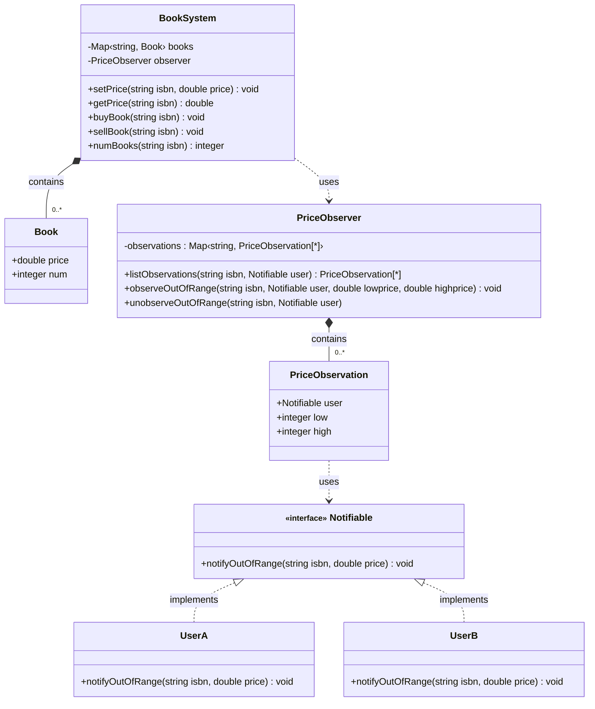
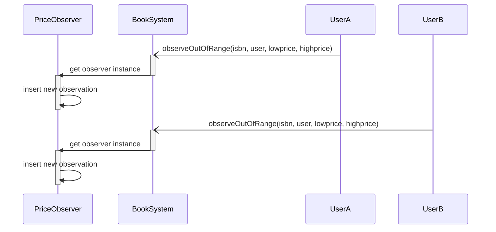
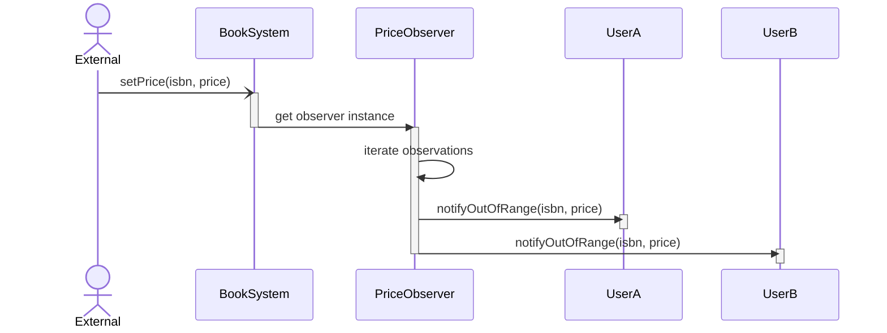
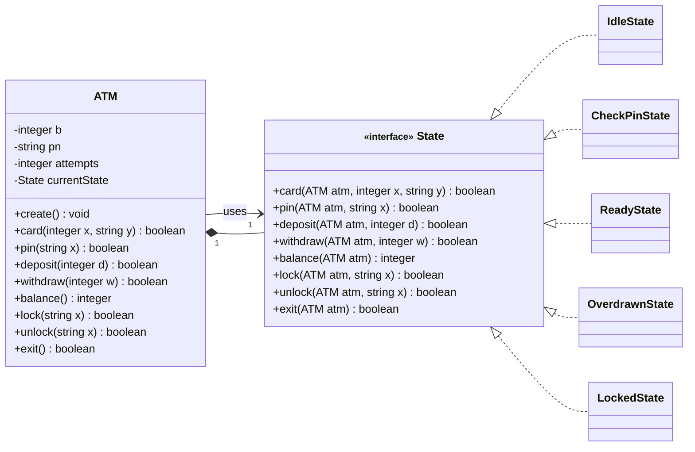
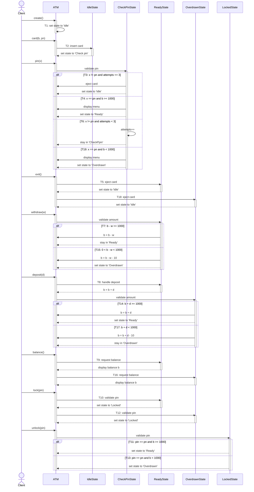
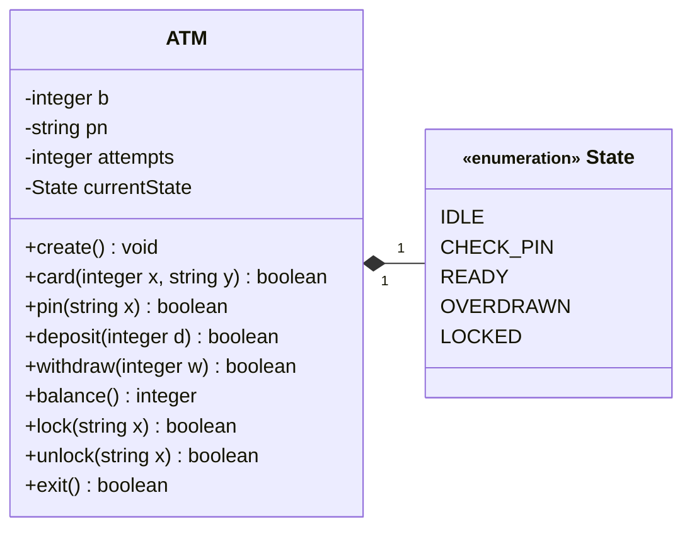

```mermaid
sequenceDiagram
  actor Client
  participant ATM
  participant State

  Client ->> ATM: create()
  activate ATM
  ATM ->> State: T1: create ATM
  activate State
  State -->> ATM: set state to 'Idle'
  deactivate State
  deactivate ATM

  Client ->> ATM: card(b, pn)
  activate ATM
  ATM ->> State: T2: insert card
  activate State
  State -->> ATM: set state to 'CheckPin'
  deactivate State
  deactivate ATM

  Client ->> ATM: pin(x)
  activate ATM
  ATM ->> State: validate pin
  activate State
  alt T3: x != pn and attempts == 3
    State ->> ATM: eject card
    State -->> ATM: set state to 'Idle'
  else T4: x == pn and b >= 1000
    State ->> ATM: display menu
    State -->> ATM: set state to 'Ready'
  else T6: x != pn and attempts < 3
    State ->> State: attempts++
    State -->> ATM: set state to 'CheckPin'
  else T19: x == pn and b < 1000
    State ->> ATM: display menu
    State -->> ATM: set state to 'Overdrawn'
  end
  deactivate State
  deactivate ATM

  Client ->> ATM: exit()
  activate ATM
  ATM ->> State: prepare exit
  activate State
  alt T5: from 'Ready'
    State ->> ATM: eject card
    State -->> ATM: set state to 'Idle'
  else T18: from 'Overdrawn'
    State ->> ATM: eject card
    State -->> ATM: set state to 'Idle'
  end
  deactivate State
  deactivate ATM

  Client ->> ATM: withdraw(w)
  activate ATM
  ATM ->> State: validate amount
  activate State
  alt T7: b - w >= 1000
    State ->> ATM: b = b - w
    State -->> ATM: set state to 'Ready'
  else T15: 0 < b - w < 1000
    State ->> ATM: b = b - w - 10
    State -->> ATM: set state to 'Overdrawn'
  end
  deactivate State
  deactivate ATM

  Client ->> ATM: deposit(d)
  activate ATM
  ATM ->> State: validate amount
  activate State
  alt T8: from Ready
    State ->> ATM: b = b + d
    State -->> ATM: set state to 'Ready'
  else T14: from 'Overdrawn', b + d >= 1000
    State ->> ATM: b = b + d
    State -->> ATM: set state to 'Ready'
  else T17: from 'Overdrawn', b + d < 1000
    State ->> ATM: b = b + d - 10
    State -->> ATM: set state to 'Overdrawn'
  end
  deactivate State
  deactivate ATM

  Client ->> ATM: balance()
  activate ATM
  ATM ->> State: request balance
  activate State
  alt T9: from 'Ready'
    State ->> ATM: display balance b
    State -->> ATM: set state to 'Ready'
  else T16: from 'Overdrawn'
    State ->> ATM: display balance b
    State -->> ATM: set state to 'Overdrawn'
  end
  deactivate State
  deactivate ATM

  Client ->> ATM: lock(pin)
  activate ATM
  ATM ->> State: validate pin
  activate State
  alt T10: from 'Ready', pin == pn
    State -->> ATM: set state to 'Locked'
  else T12: from 'Overdrawn', pin == pn
    State -->> ATM: set state to 'Locked'
  end
  deactivate State
  deactivate ATM

  Client ->> ATM: unlock(pin)
  activate ATM
  ATM ->> State: validate pin
  activate State
  alt T11: pin == pn and b >= 1000
    State -->> ATM: set state to 'Ready'
  else T13: pin == pn and b < 1000
    State -->> ATM: set state to 'Overdrawn'
  end
  deactivate State
  deactivate ATM
```

<!-- KaTeX -->
<script
  type="text/javascript"
  src="http://cdn.mathjax.org/mathjax/latest/MathJax.js?config=TeX-AMS-MML_HTMLorMML">
</script>

# [Homework 1](https://github.com/hanggrian/IIT-CS586/blob/assets/assignments/hw1_1.pdf)

> For each solution:
>
> 1.  Provide a class diagram for the system. For each class, list all
      operations with parameters and specify them using **pseudo-code.** In
      addition, for each class, provide its attributes and data structures. Make
      the necessary assumptions for your design.
> 1.  Provide a **sequence diagram** for the following operation sequence:
>
>     ```
>     create(), card(1100, "xyz"), pin("xyz"), deposit(300), withdraw(500), exit()
>     ```
>
>     When the EFSM model is "executed" on this sequence of operations, the
      following sequence of transitions is traversed/executed: $T_1$, $T_2$,
      $T_4$, $T_8$, $T_{15}$, $T_{18}$

## Problem 1

> In the system, there exists a class *BookSystem* which keeps track of prices
  of books in the Book Market. This class supports the following operations:
  `setPrice(ISBN, price)`, `getPrice(ISBN)`, `buyBook(ISBN)`, `sellBook(ISBN)`,
  and `numBooks(ISBN)`. The `setPrice(price, ISBN)` operation sets a new price
  for the book uniquely identified by *ISBN.* The `getPrice(ISBN)` operation
  returns the current price of the book identified by *ISBN.* The
  `buyBook(ISBN)` operation is used to buy a book identified *by ISBN.* The
  `sellBook(ISBN)` operation is used to sell a book identified by *ISBN.* The
  operation `numBooks(ISBN)` returns the number of copies of a book identified
  by ISBN that are available in the system. Notice that each book is uniquely
  identified by *ISBN.*
>
> In addition, there exist user components in the system (e.g., *UserA, UserB,*
  etc.) that are interested in watching the changes in book prices, especially,
  they are interested in watching the out-of-range book price changes.
  Specifically, interested users may register with the system to be notified
  when the price of the book of interest falls outside of the specified price
  range. During registration, the user needs to provide the boundaries
  (*lowprice, highprice*) for the price range for the specific book, where
  *lowprice* is the lower book price and *highprice* is the upper book price of
  the price range. At any time, users may un-register when they are not
  interested in watching the out-of-range book price changes of a specific book.
  Each time the price of a book changes, the system notifies all registered
  users (for which the new book price is outside of the specified price range)
  about the out-of-range book price change. Notice that if the book price change
  is within the specified price range for a given user, this user is not
  notified about this price change.
>
> ```mermaid
> classDiagram
>   class BookSystem {
>     -List&lt;ISBN, price, num&gt;
>     +setPrice()
>     +getPrice()
>     +buyBook()
>     +sellBook()
>     +numBooks()
>   }
>   class UserA {
>     +showPrice()
>   }
>   class UserB {
>     +showPrice()
>   }
> ```
>
> Design the system using the **Observer pattern.** Provide a class diagram for
  the system that should include classes *BookSystem, UserA, and UserB* (if
  necessary, introduce new classes and operations). In your design, it should be
  easy to introduce new types of user components (e.g., *UserC*) that are
  interested in observing the changing prices of books. Notice that the
  components in your design should be decoupled as much as possible. In
  addition, components should have high cohesion.
>
> **In your solution:**
>
> 1.  Provide a class diagram for the system. For each class, list all
      operations with parameters and specify them using **pseudo-code.** In
      addition, for each class, provide its attributes/data structures. Make the
      necessary assumptions for your design.
>
> 1.  Provide two **sequence diagrams** showing:
>
>     - How components *UserA* and *UserB* register to be notified about the
        out-of-range book price change.
>     - How the system notifies the registered user components about the
        out-of-range book price change.

### Class diagram

There are simple data classes `Book` and `PriceObservation` that are used in the
system’s data structure. The implementation of the observer pattern is decoupled
in a separate class, `PriceObserver`. To share the same attributes, an interface
`Notifiable` is shared among user components to listen for out-of-range price
changes made in the system.



### Pseudo-code

The book inventory and price observations are maintained as maps (or
dictionaries) for efficient retrieval by ISBN. In the observer pattern
implementation, the value of this map is a dynamically-sized array (or list).
The operation to find a book in inventory is $O(1)$, while traversing
observations to find a matching user is $O(n)$ for every price change.

```vb
class Book {
  double price
  integer num
}

class PriceObservation {
  Notifiable user
  double low
  double high
}

class BookSystem {
  Map<string, Book> books
  PriceObserver observer

  'Modify a book price and notify users of any out-of-range price change.'
  void setPrice(string isbn, double price) {
    IF price < 0 THEN
      THROW ERROR
    END IF
    Map<String, PriceObservation[*]> observations -> observer.observations
    PriceObservation[*] os -> observations[isbn]
    FOR PriceObservation o IN os THEN
      IF o.isbn -> isbn THEN
        CONTINUE
      END IF
      IF o.lowprice <= price AND
        price <= o.highprice THEN
        CONTINUE
      END IF
      Notifiable u -> o.user
      u.notifyOutOfRange()
    END FOR
    Book b -> books[ISBN]
    b.price -> price
    books[isbn] -> b
  }

  'Returns the book price.'
  double getPrice(string isbn) {
    Book b -> books[ISBN]
    RETURN b.price
  }

  'Increment a book count, or insert new item in case of a new inventory.'
  void buyBook(string isbn) {
    Book b -> books[ISBN]
    IF NOT b -> null THEN
      b.num -> b.num + 1
      books[isbn] -> b
      RETURN
    END IF
    Book b2
    b2.price -> MAX_VALUE
    b2.num -> 1
    books[isbn] -> b2
  }

  'Reduce a book count, or error when current count is non-positive.'
  void sellBook(string isbn) {
    Book b -> books[ISBN]
    IF b -> null OR current < 1 THEN
      THROW ERROR
    END IF
    IF b > 1 THEN
      b.num -> b.num - 1
      books[isbn] -> b
      RETURN
    END IF
    books -> books - b 'by removing key'
  }

  'Count available books given ISBN.'
  integer numBooks(string isbn) {
    Book b -> books[ISBN]
    RETURN b.num
  }
}

class PriceObserver {
  Map<String, PriceObservation[*]> observations

  'List user observations of any book.'
  PriceObservation[*] listObservations(string isbn, Notifiable user) {
    PriceObservation[*] result
    FOR (string isbn, PriceObservation[*] os) IN observations THEN
      FOR PriceObservation o IN os THEN
        IF o.user -> user THEN
          result -> result + o
        END IF
      END FOR
    END FOR
    RETURN result
  }

  'Register to listen to price changes, multiple price range of the same book'
  'is allowed.'
  void observeOutOfRange(
    string isbn,
    Notifiable user,
    double lowprice,
    double highprice
  ) {
    IF lowprice < highprice THEN
      THROW ERROR
    END IF
    PriceObservation o
    o.user -> user
    o.low -> lowprice
    o.high -> highprice
    observations[isbn] -> observations[isbn] + o
  }

  'Removes all book observations by ISBN assigned to this user.'
  void unobserveOutOfRange(string isbn, Notifiable user) {
    PriceObservation[*] os -> observations[isbn]
    FOR PriceObservation o IN os THEN
      IF o.user -> user AND o.isbn -> isbn THEN
        o -> os - o
      END IF
    END FOR
  }
}

interface Notifiable {
  'Abstract method that will be triggered upon price change.'
  void notifyOutOfRange(string isbn, double price)
}

class UserA implements Notifiable {
  void notifyOutOfRange(string isbn, double price) {
    'TODO: custom implementation.'
  }
}

class UserB implements Notifiable {
  void notifyOutOfRange(string isbn, double price) {
    'TODO: custom implementation.'
  }
}
```

### Sequence diagrams

#### Subscribing observations

Users can subscribe to receive notifications about out-of-range price changes
for their selected movies. After invoking an observation method, the book system
calls upon a price observer instance and finds a list of observations given a
book's ISBN. Then, inserts a new observation preference into the existing list.



#### Notifying observers

The system waits for any price change made to book inventory. When a price
modification is detected, it iterates the observation list to find a matching
ISBN where the changed price doesn't match the preferred range. It then invokes
the abstract `notifyOutOfRange()`, which may differ from component to component.



## Problem 2

> The ATM component supports the following operations:
>
> ```vb
> create()                  'ATM is created'
> card(integer x, string y) 'ATM card is inserted where x is a balance and y is a pin #'
> pin(string x)             'provides pin #'
> deposit(integer d)        'deposit amount d'
> withdraw(integer w)       'withdraw amount w'
> balance()                 'display the current balance'
> lock(string x)            'lock the ATM, where x is a pin #'
> unlock(string x)          'unlock the ATM, where x is pin #'
> exit()                    'exit from the ATM'
> ```
>
> A simplified EFSM model for the ATM component is shown on the next page.
>
> ```mermaid
> ---
> config:
>   flowchart:
>     defaultRenderer: "elk"
> ---
> flowchart LR
>   Start("Start") --T<sub>1</sub>--> Idle
>   Idle --T<sub>2</sub>--> CheckPin["Check pin"]
>   CheckPin --T<sub>3</sub>--> Idle
>   CheckPin --T<sub>4</sub>--> Ready
>   Ready --T<sub>5</sub>--> Idle
>   CheckPin --T<sub>6</sub>--> CheckPin
>   Ready --T<sub>7</sub>--> Ready
>   Ready --T<sub>8</sub>--> Ready
>   Ready --T<sub>9</sub>--> Ready
>   Ready --T<sub>10</sub>--> Locked
>   Locked --T<sub>11</sub>--> Ready
>   Overdrawn --T<sub>12</sub>--> Locked
>   Locked --T<sub>13</sub>--> Overdrawn
>   Overdrawn --T<sub>14</sub>--> Ready
>   Ready --T<sub>15</sub>--> Overdrawn
>   Overdrawn --T<sub>16</sub>--> Overdrawn
>   Overdrawn --T<sub>17</sub>--> Overdrawn
>   Overdrawn --T<sub>18</sub>--> Idle
>   CheckPin --T<sub>19</sub>--> Overdrawn
> ```
>
> Step | Operation
> ---: | ---
> $T_1$ | `create()`
> $T_2$ | `card(x, y) / b = x`<br>`pn = y`<br>`attempts = 0`
> $T_3$ | `pin(x)[(x != pn) && (attempts == 3)] / eject card`
> $T_4$ | `pin(x)[(x == pn) && (b >= 1000)] / display menu`
> $T_5$ | `exit / eject card`
> $T_6$ | `pin(x)[(x != pn) && (attempts < 3)] / attempts++`
> $T_7$ | `withdraw(x)[b - w >= 1000] / b = b - w`
> $T_8$ | `deposit(d) / b = b + d`
> $T_9$ | `balance()`<br>`display balance b`
> $T_{10}$ | `lock(x)[x == pn]`
> $T_{11}$ | `unlock(x)[(x == pn) && (b >= 1000)]`
> $T_{12}$ | `lock(x)[x == pn]`
> $T_{13}$ | `unlock(x)[(x == pn) && (b < 1000)]`
> $T_{14}$ | `deposit(d)[b + d >= 1000] / b = b + d`
> $T_{15}$ | `withdraw(w)[(b - w < 1000) && (b - w > 0)] / b = b - w - 10`
> $T_{16}$ | `balance / display balance b`
> $T_{17}$ | `deposit(d)[b + d < 1000] / b = b + d - 10`
> $T_{18}$ | `exit / eject card`
> $T_{19}$ | `pin(x)[(x == pn) && (b < 1000)] / display menu`
>
> A simplified EFSM model for the *ATM* component is shown on the next page.
>
> Design the system using the **State design pattern.** Provide two solutions:
>
> - **a decentralized** version of the State pattern
> - **a centralized** version of the State pattern
>
> Notice that the components in your design should be **decoupled** as much as
  possible. In addition, components should have high **cohesion.**

### Decentralized version

#### Class diagram

In the centralized version, states are defined as an enumeration. Each entry in
the `State` enumeration represents a node defined in the EFSM of `ATM`. In
addition to all methods declared in the problem statement, the ATM holds an
additional state property to keep track of the current ATM phase.



#### Pseudo-code

Methods in the State interface have a default return value, so that the
implementing class can choose which methods to override. The methods related to
ATM operations are delegated to the state classes. For example, because users
may only insert a card when the ATM machine is idle, executing functions other
than `card()` will yield false.

```vb
class ATM {
  State currentState

  void create() {
    'T1'
    currentState -> IdleState
  }

  boolean card(integer x, string y) {
    RETURN currentState.card(this, x, y)
  }

  boolean pin(string x) {
    RETURN currentState.pin(this, x)
  }

  boolean deposit(integer d) {
    RETURN currentState.deposit(this, d)
  }

  boolean withdraw(integer w) {
    RETURN currentState.withdraw(this, w)
  }

  integer balance() {
    RETURN currentState.balance(this)
  }

  boolean lock(string x) {
    RETURN currentState.lock(this, x)
  }

  boolean unlock(string x) {
    RETURN currentState.unlock(this, x)
  }

  boolean exit() {
    RETURN currentState.exit(this)
  }
}

interface State {
  boolean card(ATM atm, integer x, string y) {
    RETURN false
  }

  boolean pin(ATM atm, string x) {
    RETURN false
  }

  boolean deposit(ATM atm, integer d) {
    RETURN false
  }

  boolean withdraw(ATM atm, integer w) {
    RETURN false
  }

  integer balance(ATM atm) {
    RETURN -1
  }

  boolean lock(ATM atm, string x) {
    RETURN false
  }

  boolean unlock(ATM atm, string x) {
    RETURN false
  }

  boolean exit(ATM atm) {
    RETURN false
  }
}

class IdleState implements State {
  boolean card(ATM atm, integer x, string y) {
    'T2'
    b -> x
    pn -> y
    attempts -> 0
    atm.currentState -> CheckPinState()
    RETURN TRUE
  }
}

class CheckPinState implements State {
  boolean pin(ATM atm, string x) {
    'T3'
    IF NOT x -> pn AND attempts == 3 THEN
      'eject card'
      atm.currentState -> IdleState()
      RETURN TRUE
    'T4'
    ELSE IF x -> pn AND b >= 1000 THEN
      'display menu'
      atm.currentState -> ReadyState()
      RETURN TRUE
    'T6'
    ELSE NOT x -> pn AND attempts < 3 THEN
      attempts -> attempts + 1
      atm.currentState -> CheckPinState()
      RETURN TRUE
    'T19'
    ELSE IF x -> pn AND b < 1000 THEN
      'display menu'
      atm.currentState -> OverdrawnState()
      RETURN TRUE
    END IF
    RETURN FALSE
  }
}

class ReadyState implements State {
  boolean deposit(ATM atm, integer d) {
    'T8'
    b -> b + d
    atm.currentState -> ReadyState()
    RETURN TRUE
  }

  boolean withdraw(ATM atm, integer w) {
    'T7'
    IF b - w >= 1000 THEN
      b -> b - w
      atm.currentState -> ReadyState()
      RETURN TRUE
    'T15'
    ELSE IF b - w > 0 AND b - w < 1000 THEN
      b -> b - w - 10
      atm.currentState -> OverdrawnState()
      RETURN TRUE
    END IF
    RETURN FALSE
  }

  integer balance(ATM atm) {
    'T9'
    RETURN b
  }

  boolean lock(ATM atm, string x) {
    'T10'
    IF NOT x -> pn THEN
      RETURN FALSE
    END IF
    atm.currentState -> LockedState()
    RETURN TRUE
  }

  boolean exit(ATM atm) {
    'T5'
    'eject card'
    atm.currentState -> IdleState()
    RETURN TRUE
  }
}

class OverdrawnState implements State {
  boolean deposit(ATM atm, integer d) {
    'T14'
    IF b + d >= 1000 THEN
      b -> b + d
      atm.currentState -> ReadyState()
    'T17'
    ELSE
      b -> b + d - 10
      atm.currentState -> OverdrawnState()
    END IF
    RETURN TRUE
  }

  integer balance(ATM atm) {
    'T16'
    RETURN b
  }

  boolean lock(ATM atm, string x) {
    'T12'
    IF NOT x -> pn THEN
      RETURN FALSE
    END IF
    atm.currentState -> State.LOCKED
    RETURN TRUE
  }

  boolean exit(ATM atm) {
    'T18'
    'eject card'
    atm.currentState -> IdleState()
    RETURN TRUE
  }
}

class LockedState implements State {
  boolean unlock(ATM atm, string x) {
    IF NOT x -> pn THEN
      RETURN FALSE
    END IF
    'T11'
    IF b >= 1000 THEN
      atm.currentState -> ReadyState()
    'T13'
    ELSE
      atm.currentState -> OverdrawnState()
    END IF
    RETURN TRUE
  }
}
```

#### Sequence diagram

A client starts by instantiating the ATM class. At the end of every operation, a
new state is assigned to the ATM. The current state of the ATM determines the
next possible action a client may take.



### Centralized version

#### Class diagram

Each entry in the `State` enumeration represents a node defined in the EFSM of
ATM. In addition to all methods declared in the problem statement, the `ATM`
holds an additional state property to keep track of the current ATM phase.



#### Pseudo-code

Most functions (all except `create()` and `balance()`) return a Boolean value
indicating whether the intended operation was executed successfully. For
example, `card(x, y)` will always yield false when the ATM is not idle. Instead
of an overridden implementation as seen in the decentralized version, the
centralized version relies on conditional checks to determine which logic
applies given the current state.

```vb
enum State {
  IDLE
  CHECK_PIN
  READY
  OVERDRAWN
  LOCKED
}

class ATM {
  integer b
  string pn
  integer attempts
  State currentState

  void create() {
    'T1'
    currentState -> State.IDLE
  }

  boolean card(integer x, string y) {
    IF NOT currentState -> State.IDLE THEN
      RETURN FALSE
    END IF
    'T2'
    b -> x
    pn -> y
    attempts -> 0
    currentState -> State.CHECK_PIN
    RETURN TRUE
  }

  boolean pin(string x) {
    IF NOT currentState -> State.CHECK_PIN THEN
      RETURN FALSE
    END IF
    'T3'
    IF NOT x -> pn AND attempts == 3 THEN
      'eject card'
      currentState -> State.IDLE
      RETURN TRUE
    'T4'
    ELSE IF x -> pn AND b >= 1000 THEN
      'display menu'
      currentState -> State.READY
      RETURN TRUE
    'T6'
    ELSE NOT x -> pn AND attempts < 3 THEN
      attempts -> attempts + 1
      currentState -> State.CHECK_PIN
      RETURN TRUE
    'T19'
    ELSE IF x -> pn AND b < 1000 THEN
      'display menu'
      currentState -> State.OVERDRAWN
      RETURN TRUE
    END IF
    RETURN FALSE
  }

  boolean deposit(integer d) {
    'T8'
    IF currentState -> State.READY THEN
      b -> b + d
      currentState -> State.READY
      RETURN TRUE
    END IF
    IF NOT currentState -> State.OVERDRAWN THEN
      RETURN FALSE
    END IF
    'T14'
    IF b + d >= 1000 THEN
      b -> b + d
      currentState -> State.READY
    'T17'
    ELSE
      b -> b + d - 10
      currentState -> State.OVERDRAWN
    END IF
    RETURN TRUE
  }

  boolean withdraw(integer w) {
    IF NOT currentState -> State.READY THEN
      RETURN FALSE
    END IF
    'T7'
    IF b - w >= 1000 THEN
      b -> b - w
      currentState -> State.READY
      RETURN TRUE
    'T15'
    ELSE IF b - w > 0 AND b - w < 1000 THEN
      b -> b - w - 10
      currentState -> State.OVERDRAWN
      RETURN TRUE
    END IF
    RETURN FALSE
  }

  integer balance() {
    IF NOT currentState -> State.READY AND
      NOT currentState -> State.OVERDRAWN THEN
      RETURN -1
    END IF
    'T9,T16'
    RETURN b
  }

  boolean lock(string x) {
    IF NOT currentState -> State.READY AND
      NOT currentState -> State.OVERDRAWN THEN
      RETURN FALSE
    END IF
    'T10,T12'
    IF NOT x -> pn THEN
      RETURN FALSE
    END IF
    currentState -> State.LOCKED
    RETURN TRUE
  }

  boolean unlock(string x) {
    IF NOT currentState -> State.LOCKED OR NOT x -> pn THEN
      RETURN FALSE
    END IF
    'T11'
    IF b >= 1000 THEN
      currentState -> State.READY
    'T13'
    ELSE
      currentState -> State.OVERDRAWN
    END IF
    RETURN TRUE
  }

  boolean exit() {
    IF NOT currentState -> State.READY AND
      NOT currentState -> State.OVERDRAWN THEN
      RETURN FALSE
    END IF
    'T5,T18'
    'eject card'
    currentState -> State.IDLE
    RETURN TRUE
  }
}
```

#### Sequence diagram

The ATM keeps track of the current phase by storing a state property in
enumeration form. As opposed to a custom implementation in each separate class,
the main class relies on conditional state checks in its method statements.
Other than that, the operations and their notation are comparable to the
decentralized state pattern.


