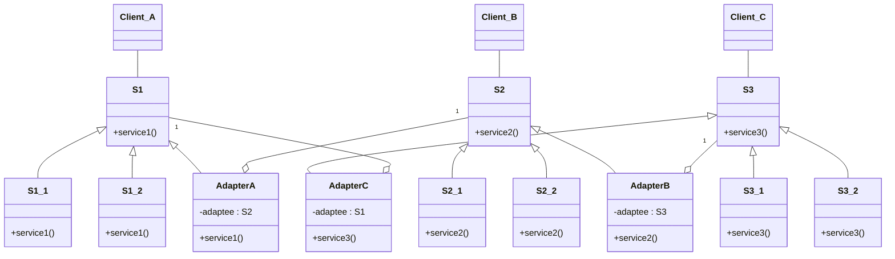
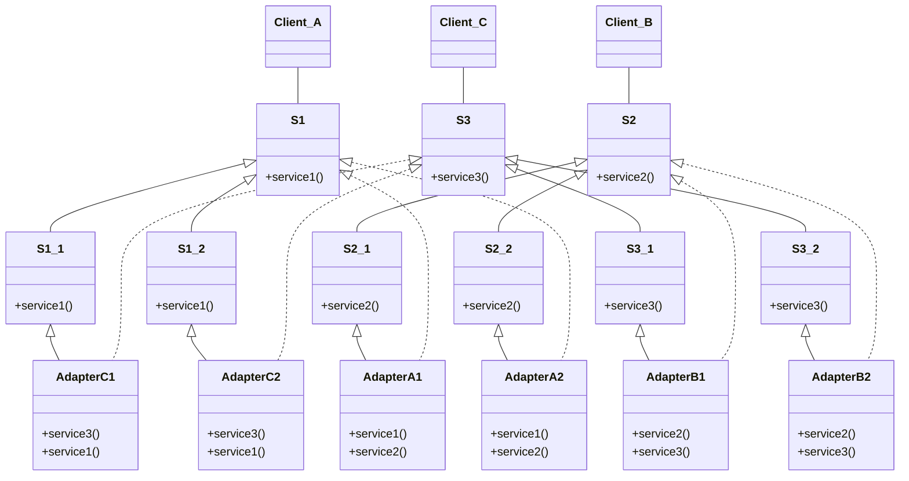
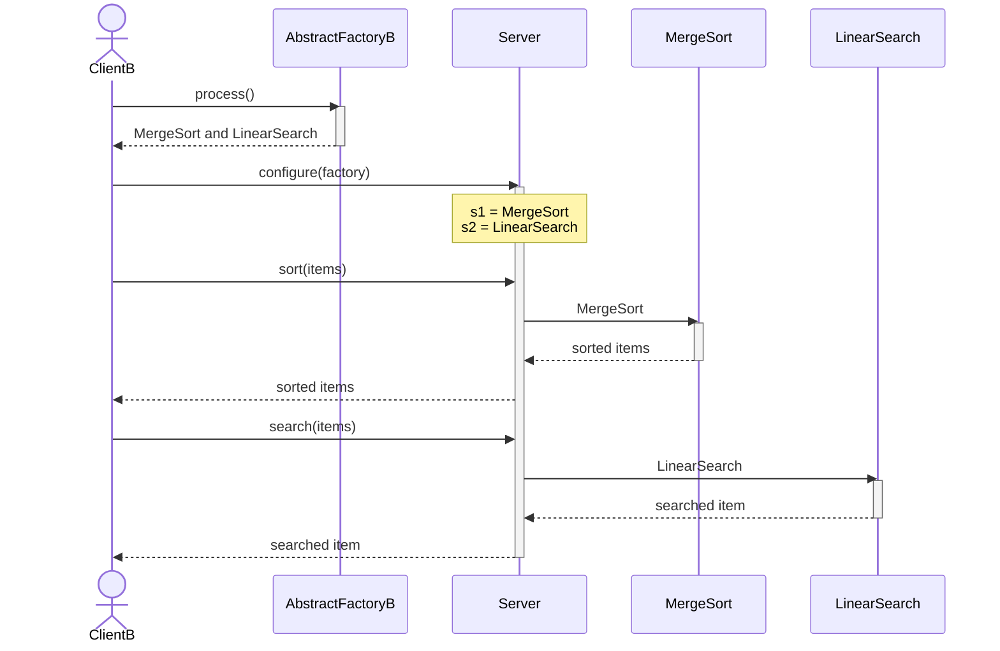

<!-- KaTeX -->
<script
  type="text/javascript"
  src="http://cdn.mathjax.org/mathjax/latest/MathJax.js?config=TeX-AMS-MML_HTMLorMML">
</script>
<script
  type="text/x-mathjax-config">
  MathJax.Hub.Config({tex2jax: {inlineMath: [['$','$'], ['\\(','\\)']]}});
</script>

# [Homework 2](https://github.com/hanggrian/IIT-CS586/blob/assets/assignments/hw2_1.pdf)

## Problem 1

> There exist two servers S1 and S2. Both servers support the following
  services:
> <table>
> </table>
>
> Services supported by **server-S1:**
>
> - `void service1(string, integer, integer)`
> - `void service2(string, integer, integer)`
> - `integer service3(string)`
> - `float service4(string)`
>
> Services supported by **server-S2:**
>
> - `void service1(string, integer)`
> - `void service2(string, integer)`
> - `integer service3(string)`
> - `float service4(string)`
>
> There exist two client processes, and they request the following services:
>
> **Client-A:**
>
> - `void service1(string, integer, integer)`
> - `void service2(string, integer)`
> - `integer service3(string)`
> - `float service4(string)`
>
> **Client-B:**
>
> - `void service1(string, integer)`
> - `void service2(string, integer, integer)`
> - `integer service3(string)`
> - `float service4(string)`
>
> The client processes do not know the location (pointer) to servers that may
  provide these services. Devise a software architecture using a
  **Client-Broker-Server** architecture for this problem. In this design, the
  client processes are not aware of the location of the servers providing these
  services.
>
> - Provide a class diagram for the proposed architecture. In your design, all
    components should be **decoupled** as much as possible.
> - Provide the **pseudocode** for all operations of the following
    components/classes:
>   - Broker
>   - Client Proxy of *Client-A*
>   - Server Proxy of *Server-2*
> - Provide a sequence diagram to show how *Client-A* gets
    `void service2(string, integer)`.

### Class diagram


### Pseudo-code

```vb
class Broker {
  ServerProxy[] proxies

  void registerServer(ServerProxy proxy) {
    proxies <- proxies + proxy
  }

  void unregisterServer(ServerProxy proxy) {
    proxies <- proxies - proxy
  }

  Object routeRequest(Request request) {
    'There may be multiple proxies of the same server, execute once.'
    FOR proxy IN proxies DO
      Response response <- proxy.handleRequest(request)
      IF response.isSuccess THEN
        RETURN response.result
      END IF
    END FOR
    THROW ERROR("Server not found.")
  }
}

class ClientAProxy {
  Broker broker

  void service1(string s, integer i1, integer i2) {
    Request request
    request.serviceName <- "service1"
    request.parameterTypes <- [string, integer, integer]
    request.parameterValues <- [s, i1, i2]
    sendRequest(request)
  }

  void service2(string s, integer i) {
    Request request
    request.serviceName <- "service2"
    request.parameterTypes <- [string, integer]
    request.parameterValues <- [s, i]
    sendRequest(request)
  }

  integer service3(string s) {
    Request request
    request.serviceName <- "service3"
    request.parameterTypes <- [string]
    request.parameterValues <- [s]
    integer result <- sendRequest(request)
    RETURN result
  }

  float service4(string s) {
    Request request
    request.serviceName <- "service4"
    request.parameterTypes <- [string]
    request.parameterValues <- [s]
    float result <- sendRequest(request)
    RETURN result
  }

  Object sendRequest(Request request) {
    broker.routeRequest(request)
  }
}

class Server2Proxy {
  Server2 server2

  Response handleRequest(Request request) {
    name <- request.serviceName
    types <- request.parameterTypes
    values <- request.parameterValues

    Response response
    IF name == "service1" THEN
      IF types.size == 3 AND
        types[0] == string AND
        types[1] == integer AND
        types[2] == integer THEN
        response.isSuccess <- TRUE
        server2.service1(values[0], values[1], values[2])
      END IF
    ELSE IF name == "service2" THEN
      IF types.size == 3 AND
        types[0] == string AND
        types[1] == integer AND
        types[2] == integer THEN
        response.isSuccess <- TRUE
        server2.service2(values[0], values[1], values[2])
      END IF
    ELSE IF name == "service3" THEN
      IF types.size == 1 AND
        types[0] == string THEN
        response.isSuccess <- TRUE
        response.result <- server2.service3(values[0])
      END IF
    ELSE IF name == "service4" THEN
      IF types.size == 1 AND
        types[0] == string THEN
        response.isSuccess <- TRUE
        response.result <- server2.service4(values[0])
      END IF
    END IF
    RETURN response
  }
}
```

### Sequence diagram


## Problem 2

> ```mermaid
> classDiagram
>   direction TB
>   class S1 {
>     +service1()
>   }
>   class S1_1 {
>     +service1()
>   }
>   class S1_2 {
>     +service1()
>   }
>   S1 <|-- S1_1
>   S1 <|-- S1_2
>   Client_A -- S1
>
>   class S2 {
>     +service2()
>   }
>   class S2_1 {
>     +service2()
>   }
>   class S2_2 {
>     +service2()
>   }
>   S2 <|-- S2_1
>   S2 <|-- S2_2
>   Client_B -- S2
>
>   class S3 {
>     +service3()
>   }
>   class S3_1 {
>     +service3()
>   }
>   class S3_2 {
>     +service3()
>   }
>   S3 <|-- S3_1
>   S3 <|-- S3_2
>   Client_C -- S3
> ```
>
> A design of a system is shown above. In this system, *Client_A* uses objects
  of classes *S1_1* and *S1_2,* *Client_B* uses objects of classes *S2_1* and
  *S2_2,* and *Client_C* uses objects of classes *S3_1* and *S3_2*.
>
> *Client_A* would like to use objects, operations *service2(),* of classes
  *S2_1* and *S2_2* by invoking operation *service1().* *Client_C* would like to
  use objects, operation *service1(),* of classes *S1_1* and *S1_2* by invoking
  operation *service3().* In addition, *Client_B* would like to use objects,
  operation *service3(),* of classes *S3_1* and *S3_2* by invoking operation
  *service2().*
>
> Provide a design with minimal modifications to the existing system using the
  Adapter design pattern in which (1) *Client_A* can use objects of classes
  *S2_1* and *S2_2* by invoking operations *service1(),* (2) *Client_B* can use
  objects of classes *S3_1,* and *S3_2* by invoking operations *service2(),* and
  (3) *Client_C* can use objects of classes *S1_1,* and *S1_2* by invoking
  operations *service3().* Notice that none of the classes shown in the above
  class diagram should be modified. Provide two solutions that are based on:
>
> 1.  An association-based version of the Adapter pattern
> 1.  An inheritance-based version of the Adapter pattern
>
> Provide a class diagram for each solution. You do not have to provide any
  description for classes/operations of the above class diagram (only new
  classes/operations should be described using pseudo-code).

### Association-based version

#### Class diagram



#### Pseudo-code

```vb
class AdapterA implements S1 {
  S2 adaptee

  void service1() {
    adaptee.service2()
  }
}

class AdapterB implements S2 {
  S3 adaptee

  void service2() {
    adaptee.service3()
  }
}

class AdapterC implements S3 {
  S1 adaptee

  void service3() {
    adaptee.service1()
  }
}
```

### Inheritance-based version

#### Class diagram



#### Pseudo-code

```vb
class AdapterA1 implements S2_1, S1 {
  void service2() {
    'inherit implementation'
  }

  void service1() {
    service2()
  }
}

class AdapterA2 implements S2_2, S1 {
  void service2() {
    'inherit implementation'
  }

  void service1() {
    service2()
  }
}

class AdapterB1 implements S3_1, S2 {
  void service3() {
    'inherit implementation'
  }

  void service2() {
    service3()
  }
}

class AdapterB2 implements S3_2, S2 {
  void service3() {
    'inherit implementation'
  }

  void service2() {
    service3()
  }
}

class AdapterC1 implements S1_1, S3 {
  void service1() {
    'inherit implementation'
  }

  void service3() {
    service1()
  }
}

class AdapterC2 implements S1_2, S3 {
  void service1() {
    'inherit implementation'
  }

  void service3() {
    service1()
  }
}
```

## Problem 3

> ```mermaid
> classDiagram
>   direction LR
>   class ClientA {
>     -server : Server
>     +process()
>   }
>   class ClientB {
>     -server : Server
>     +process()
>   }
>   class Server {
>     -s1: Server1
>     -s2: Server2
>     +sort()
>     +search()
>   }
>   ClientA -- Server
>   ClientB -- Server
>   note for Server "sort() {<br>&emsp;s1.sort()<br>}<br><br>search() {<br>&emsp;s2.search()<br>}"
>
>   class Server1 {
>     +sort()
>   }
>   class Server2 {
>     +search()
>   }
>   Server -- Server1
>   Server -- Server2
>
>   class HeapSort {
>     +sort()
>   }
>   class MergeSort {
>     +sort()
>   }
>   Server1 <|-- HeapSort
>   Server1 <|-- MergeSort
>
>   class BinarySearch {
>     +search()
>   }
>   class LinearSearch {
>     +search()
>   }
>   Server2 <|-- BinarySearch
>   Server2 <|-- LinearSearch
> ```
>
> *Client A* and *Client B* get services, `sort()` and `search()`, directly from
  the *Server.* However, the *Server* gets the appropriate services from
  *HeapSort* or *MergeSort* servers for `sort()` service. In addition, the
  *Server* gets the appropriate services from *BinarySearch* or *LinearSearch*
  servers for `search()` service.
>
> In this design, clients do not have control where the services are coming
  from. However, *Client A*, by invoking `sort()` and `search()` on the
  *Server,* would like to get `sort()` service from *HeapSort* server and
  `search()` service from *BinarySearch* server. On the other hand, *Client B*,
  by invoking `sort()` and `search()` on the *Server,* would like to get `sort()`
  from *MergeSort* server and `search()` from *LinearSearch* server. Notice that
  the current design does not support this option.
>
> Use the **abstract factory** design pattern to solve this problem. In your
  solution, the *Client* classes should be completely **decoupled** from the
  issue of invoking services by the *Server* for appropriate versions of
  `sort()` and `search()`. Notice that none of the classes (and operations)
  shown in the above class diagram should be modified. However, new
  operations/classes can be introduced.
>
> - Provide the class diagram and briefly describe the responsibility of each
    class and the functionality of each operation using **pseudo-code.** In your
    design, all components should be **decoupled** as much as possible. You do
    not have to provide any description for classes/operations of the above
    class diagram (only new classes/operations should be described).
> - Provide a sequence diagram to show how *ClientB* gets `sort()` service from
    *MergeSort* server and `search()` service from *LinearSearch* server by
    invoking `sort()` and `search()` on the *Server*.

### Class diagram


### Pseudo-code

```vb
interface AbstractFactory {
  Server1 getSort()

  Server2 getSearch()
}

class AbstractFactoryA implements AbstractFactory {
  Server1 getSort() {
    HeapSort sort
    RETURN sort
  }

  Server2 getSearch() {
    BinarySearch search
    RETURN search
  }
}

class AbstractFactoryB implements AbstractFactory {
  Server1 getSort() {
    HeapSort sort
    RETURN sort
  }

  Server2 getSearch() {
    BinarySearch search
    RETURN search
  }
}

class ClientA {
  Server server
  AbstractFactoryA factory

  void process() {
    server.configure(factory)
    'Do sort and search'
  }
}

class ClientB {
  Server server
  AbstractFactoryB factory

  void process() {
    server.configure(factory)
    'Do sort and search'
  }
}

class Server {
  Server1 s1
  Server2 s2

  void configure(AbstractFactory factory) {
    s1 <- factory.getSort()
    s2 <- factory.getSearch()
  }

  Object[] sort(Object[] items) {
    Object[] result <- s1.sort(items)
    return result
  }

  Object search(Object[] items) {
    Object result <- s2.search(items)
    return result
  }
}
```

### Sequence diagram


