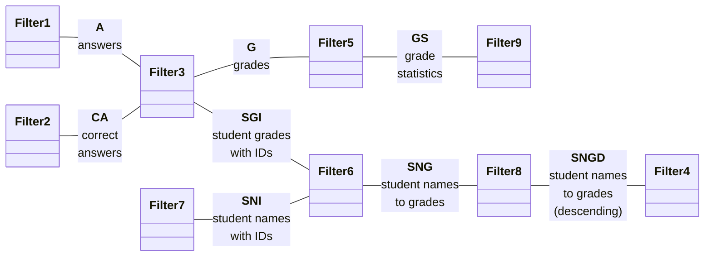
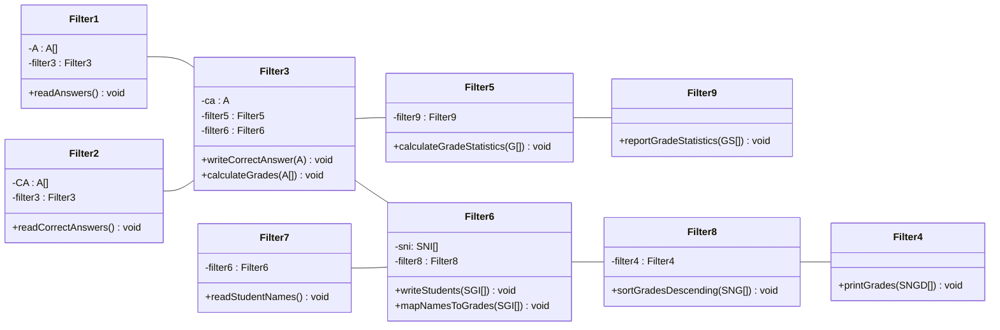

# [Homework 3](https://github.com/hanggrian/IIT-CS586/blob/assets/assignments/hw3.pdf)

## Problem 1

> Consider the problem of designing a system using the **Pipes and Filters**
  architecture. The system should provide the following functionality:
>
> - Read the student's test answers together with the student's IDs.
> - Read students' names together with their IDs.
> - Read the correct answers for the test.
> - Compute test scores.
> - Report test scores in an **ascending** order with respect to scores with
    student names.
>
> It was decided to use a Pipe and Filter architecture using the existing
  filters. The following existing filters are available:
>
> - Filter 1: This filter reads students' test answers together with students'
    IDs.
> - Filter 2: This filter reads the correct answers for the test.
> - Filter 3: This filter reads students' names together with their IDs.
> - Filter 4: This filter computes test scores.
> - Filter 5: This filter prints test scores with student names in the order in
    which they are read from an input pipe.

### Part A

> Provide the Pipe and Filter architecture for the Grader system. In your
  design, you should use all existing filters. If necessary, introduce
  additional Filters in your design and describe their responsibilities. Show
  your Pipe and Filter architecture as a directed graph consisting of Filters as
  nodes and Pipes as edges in the graph.

#### Class diagram

In addition to existing filters, four new filters are introduced to satisfy the
requirements:

- Filter 6: Provides mapping of student names and grades to IDs.
- Filter 7: Reads student names with IDs.
- Filter 8: Provides mapping of student names to grades in descending order.
- Filter 9: Reports grade statistics.



### Part B

> 1.  For the Pipe and Filter architecture of Part A, it is assumed that filters
      have different properties as shown below:
>     - Filter 1: Active filter with buffered output pipe.
>     - Filter 2: Passive filter with un-buffered pull-out pipes.
>     - Filter 3: Passive filter with un-buffered push pipes.
>     - Filter 4: Passive filter with un-buffered pull-out pipes.
>     - Filter 5: Passive filter with un-buffered push pipes.
> 1.  Use object-oriented design to refine your design. Each filter should be
      represented by a class. Provide a class diagram for your design. For each
      class, identify operations supported by the class and its attributes.
      Describe each operation using pseudo-code. In your design, filters
      **should not be aware** of other filters.
> 1.  Provide a sequence diagram for a typical execution of the system based on
      the class diagram of Step 2.

#### Class diagram



### Pseudo-code

```vb
class Filter1 {
  A[] A
  Filter3 filter3

  void readAnswers() {
    A <- 'get list of answers'
    filter3.calculateGrades(A)
  }
}

class Filter2 {
  CA[] CA
  Filter3 filter3

  void readCorrectAnswers() {
    CA <- 'get list of correct answers'
    filter3.writeCorrectAnswers(CA)
  }
}

class Filter3 {
  CA ca
  Filter5 filter5
  Filter6 filter6

  void writeCorrectAnswer(CA correctAnswer) {
    ca <- correctAnswer
  }

  void calculateGrades(A[] answers) {
    SGI <- 'calculate grades based on ca and answers'
    G <- SGI.getGrades()
    filter6.writeStudents(SGI)
    filter5.calculateGradeStatistics(G)
  }
}

class Filter4 {
  void printGrades(SNGD[] studentNamesToGradesDescending) {
    FOR sngd IN SNGD DO
      'print sorted grade'
    END FOR
  }
}

class Filter5 {
  Filter9 filter9

  void calculateGradeStatistics(G[] grades) {
    GS <- 'calculate grade statistics from grades'
    filter9.reportGradeStatistics(GS)
  }
}

class Filter6 {
  SNI[] sni
  Filter8 filter8

  void writeStudents(SNI[] studentGradesWithIDs) {
    sni <- studentGradesWithIDs
  }

  void mapNamesToGrades(SGI[] SGI) {
    SNG <- 'map student names to grades using sni and SGI'
    filter8.sortGradesDescending(SNG)
  }
}

class Filter7 {
  Filter6 filter6

  void readStudentNames() {
    SNI <- 'get list of student names with IDs'
    filter6.writeStudents(SNI)
  }
}

class Filter8 {
  Filter4 filter4

  void sortGradesDescending(SNG[] SNG) {
    SNGD <- 'sort SNG in descending order'
    filter4.printGrades(SNGD)
  }
}

class Filter9 {
  void reportGradeStatistics(GS[] GS) {
    FOR gs IN GS DO
      'print grade statistic'
    END FOR
  }
}
```

### Sequence diagram


## Problem 2

> There exist two inventory systems/servers (*Server-S1* and *Server-S2*) that
  maintain information about machine parts in warehouses, i.e., they keep track
  of the number of machine parts in warehouses. Machine parts may be added or
  removed from the warehouses, and this should be reflected in the inventory
  system. Both servers (inventory systems) support the following services:
>
> Services supported by **Server-S1:**
>
> - `void insertPart(string p, string w)`: Adds part *p* to warehouse *w.*
> - `void removePart(string p, string w)`: Deletes part *p* from warehouse *w.*
> - `int getNumOfParts(string p)`: Returns the total number of part *p* in all
    warehouses.
> - `int isPart(string p)`: Returns 1 if part *p* exists; returns 0 otherwise.
>
> Services supported by **Server-S2:**
>
> - `void addPart(string w, string p)`: Adds part *p* to warehouse *w*, where
    *p* is a part ID.
> - `void deletePart(string w, string p)`: Deletes part *p* from warehouse *w.*
> - `int getNumParts(string p)`: Returns the total number of part *p* in all
    warehouses.
> - `int isPart(string p)`: Returns 1 if part *p* exists; returns 0 otherwise.
>
> The goal is to combine both inventory systems and provide a uniform interface
  to perform operations on both existing inventory systems using the **Strict
  Layered architecture.** The following top-layer interface should be provided:
>
> - `void addPart(string p, string w)`: Adds part *p* to warehouse *w.*
> - `void removePart(string p, string w)`: Deletes part *p* from warehouse *w.*
> - `int getNumOfParts(string p)`: Returns the total number of part *p* in all
    warehouses.
> - `int isPart(string p)`: Returns 1 if part *p* exists; returns 0 otherwise.
> - `void registerCriticalPart(string p, int minimumlevel)`: Registers part *p*
    as critical with a minimum level.
> - `void unregisterCriticalPart(string p)`: Unregisters part *p* from critical
    parts.
> - `void showCriticalParts()`: Displays all critical parts.
>
> Notice that the top layer provides three additional services
  (`registerCriticalPart()`, `unregisterCriticalPart()`, and
  `showCriticalParts()`) that are not provided by the existing inventory
  systems. These services allow watching the status of critical parts. The
  user/application can register,
  `registerCriticalPart(string p, int minimumlevel)`, a critical part by
  providing its minimum level, i.e., a minimal number of parts of a specified
  part that should be present in all warehouses. When the number of parts of a
  critical part (a registered part) reaches the level below the minimum level,
  the system should store, e.g., in a buffer, the current status (number of
  parts) of the critical part. The current status of all critical parts whose
  level is below the minimum level can be displayed by invoking
  `showCriticalParts()` service. The service `unregisterCriticalPart()` allows
  removing a specified part from a list of critical parts.
>
> **Major assumptions for the design:**
>
> 1.  Users/applications that use the top-layer interface should have the
      impression that there exists only one inventory system.
> 1.  The bottom layer is represented by both inventory systems (i.e., inventory
      systems S1 and S2).
> 1.  Neither inventory system should be modified.
> 1.  Your design should contain at least **three** layers. For each layer,
      identify operations provided by the layer and its data structure(s).
> 1.  Show call relationships between services of adjacent layers.
> 1.  Each layer should be encapsulated in a class and represented by an object.
> 1.  Provide a class diagram for the combined system. For each class, list all
      operations supported by the class and major data structures. Briefly
      describe each operation in each class using **pseudo-code.**

### Class diagram


### Pseudo-code

```vb
class CriticalPartMonitor {
  InventoryFacade facade
  Map<string, integer> criticalParts
  Map<string, integer> criticalBuffer

  void addPart(string p, string w) {
    facade.addPart(p, w)
    checkCriticalPart(p)
  }

  void removePart(string p, string w) {
    facade.removePart(p, w)
    checkCriticalPart(p)
  }

  integer getNumOfParts(string p) {
    RETURN facade.getNumOfParts(p)
  }

  integer isPart(string p) {
    RETURN facade.isPart(p)
  }

  void registerCriticalPart(string p, integer minLevel) {
    criticalParts[p] <- minLevel
  }

  void unregisterCriticalPart(string p) {
    criticalParts.remove(p)
    criticalBuffer.remove(p)
  }

  void showCriticalParts() {
    FOR EACH p IN criticalBuffer.keys() DO
      'print part status'
    END FOR
  }

  void checkCriticalPart(string p) {
    IF NOT criticalParts.containsKey(p) THEN
      RETURN
    END IF
    integer currentLevel <- facade.getNumOfParts(p)
    IF currentLevel < criticalParts[p] THEN
      criticalBuffer[p] <- currentLevel
    END IF
  }
}

class InventoryFacade {
  InventoryAdapter adapter

  void addPart(string p, string w) {
    adapter.addPart(p, w)
  }

  void removePart(string p, string w) {
    adapter.removePart(p, w)
  }

  integer getNumOfParts(string p) {
    RETURN adapter.getNumOfParts(p)
  }

  integer isPart(string p) {
    RETURN adapter.isPart(p)
  }
}

class InventoryAdapter {
  ServerS1 s1
  ServerS2 s2

  void addPart(string p, string w) {
    s1.insertPart(p, w)
    s2.addPart(w, p)
  }

  void removePart(string p, string w) {
    s1.removePart(p, w)
    s2.deletePart(w, p)
  }

  integer getNumOfParts(string p) {
    integer count1 <- s1.getNumOfParts(p)
    integer count2 <- s2.getNumParts(p)
    RETURN count1 + count2
  }

  integer isPart(string p) {
    integer exists1 <- s1.isPart(p)
    integer exists2 <- s2.isPart(p)
    IF exists1 == 1 OR exists2 == 1 THEN
      RETURN 1
    ELSE
      RETURN 0
    END IF
  }
}
```

## Problem 3

> Suppose that we would like to use a fault-tolerant architecture for the
  *RemoveDuplicates* component that removes duplicates from a list of integers
  within a *low-high* range. The `unique()` operation of this component accepts
  as input integer parameters *n, low, high,* and an integer array *L.* The
  component removes duplicates whose values are greater than or equal to low but
  smaller than or equal to *high.* The output parameters are (1) an integer
  array *SL* that contains the list of integers from list *L* without duplicates
  within the *low-high* range, and (2) an integer *m* that contains the number
  of elements in list *SL.* An interface of the `unique()` operation is as
  follows:
>
> ```
> void unique(in int n, int low, int high, int L[]; out int SL[], int m)
> ```
>
> - *L*: An array of integers,
> - *n*: The number of elements in list *L.*
> - *low*: The lower bound for removing duplicates.
> - *high*: The upper bound for removing duplicates.
> - *SL*: An array of unique integers from list *L.*
> - *m*: The number of unique elements in list *SL.*
> - Notice: *L* and *n* are inputs to the `unique()` operation. *SL* and *m* are
    output parameters of the `unique()` operation.
>
> For example, for the following input:
>
> ```
> n = 8
> low = 2
> high = 6
> L = {1, 7, 1, 2, 5, 2, 7, 5}
> ```
>
> The `unique()` operation returns the following output parameters:
>
> ```
> m = 6
> SL = (1, 7, 1, 2, 5, 7)
> ```
>
> Suppose that three versions of the *RemoveDuplicates* component have been
  implemented using different algorithms. Different versions are represented by
  classes: *unique_1, unique_2,* and *unique_3.*
>
> ```mermaid
> classDiagram
>   direction TB
>   class RemoveDuplicates {
>     +unique()
>   }
>   class unique_1 {
>     +unique()
>   }
>   class unique_2 {
>     +unique()
>   }
>   class unique_3 {
>     +unique()
>   }
> ```
>
> Provide two designs for the *RemoveDuplicates* component using the following
  types of fault-tolerant software architectures:
>
> 1.  N-version architecture
> 1.  Recovery-Block architecture
>
> For each design, provide:
>
> 1.  A class diagram. For each class, identify operations supported by the
      class and its attributes. Specify in detail each operation using
      pseudo-code (you do not need to specify operations `unique()` of the
      `unique_i` classes; only new operations need to be specified).
> 1.  A sequence diagram representing a typical execution of the
      *RemoveDuplicates* component.

### N-version version

#### Class diagram


#### Pseudo-code

```vb
class RemoveDuplicates {
  Unique unique
  Validator validator

  void unique(
    in integer n, integer low, integer high, integer[] L,
    out integer m, integer[] SL
  ) {
    Unique[] U <- new Unique[3]
    U[0] <- new Unique_1()
    U[1] <- new Unique_2()
    U[2] <- new Unique_3()

    Pair<integer, integer[]>[3] LSL
    FOR i FROM 0 TO 2 DO
      U[i].unique(n, low, high, L, m, SL)
      LSL[i] <- new Pair(m, SL)
    END FOR

    Pair<integer, integer[]> pair <- validator.validate(LSL)
    m <- pair.first
    SL <- pair.second
  }
}

class Validator {
  Pair<integer, integer[]> validate(Pair<integer, integer[]>[] LSL) {
    IF LSL[0] == LSL[1] THEN
      RETURN LSL[0]
    END IF
    IF LSL[0] == LSL[2] THEN
      RETURN LSL[0]
    END IF
    IF LSL[2] == LSL[1] THEN
      RETURN LSL[1]
    END IF
    integer random <- RANDOM(0, 2)
    RETURN LSL[random]
  }
}
```

#### Sequence diagram


### Recovery-Block version

#### Class diagram


#### Pseudo-code

```vb
class RemoveDuplicates {
  Unique unique
  AcceptanceTest test

  void unique(
    in integer n, integer low, integer high, integer[] L,
    out integer m, integer[] SL
  ) {
    Unique[] U <- new Unique[3]
    Pair<integer, integer[]>[] LSL <- new Pair[3]

    U[0] <- new Unique_1()
    U[0].unique(n, low, high, L, m, SL)
    LSL[0] <- new Pair(m, SL)
    IF test.test(n, L, m, SL) THEN
      RETURN
    END IF

    U[1] <- new Unique_2()
    U[1].unique(n, low, high, L, m, SL)
    LSL[1] <- new Pair(m, SL)
    IF test.test(n, L, m, SL) THEN
      RETURN
    END IF

    U[2] <- new Unique_3()
    U[2].unique(n, low, high, L, m, SL)
    LSL[2] <- new Pair(m, SL)
    IF test.test(n, L, m, SL) THEN
      RETURN
    END IF

    integer random <- RANDOM(0, 2)
    Pair<integer, integer[]> pair <- LSL[random]
    m <- pair.first
    SL <- pair.second
  }
}

class AcceptanceTest {
  boolean test(
    in integer n, integer[] L,
    out integer m, integer[] SL
  ) {
    IF n < m THEN
      RETURN FALSE
    END IF
    IF m != LENGTH(SL) THEN
      RETURN FALSE
    END IF

    FOR i FROM 0 TO n - 1 DO
      FOR j FROM 0 TO m - 1 DO
        IF SL[i] == SL[j] AND i != j THEN
          RETURN FALSE
        END IF
      END FOR
    END FOR
    RETURN TRUE
  }
}
```

#### Sequence diagram


