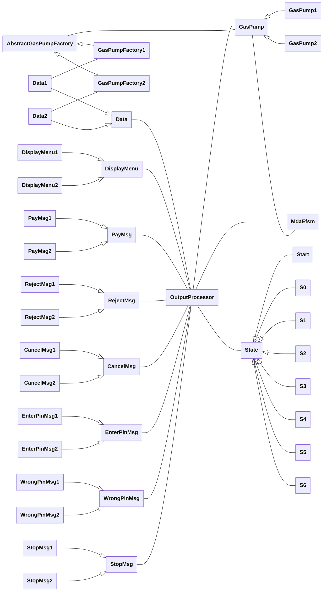

# [Project part 1: MDA-EFSM](https://github.com/hanggrian/IIT-CS586/blob/assets/assignments/proj1_1.pdf)

> There are two gas pump components: *GP-1* and *GP-2.*
>
> The gas pump **GP-1** component supports the following operations:
>
> ```vb
> activate(float a) 'the gas pump is activated, where a is the price of the '
>   'gas per liter'
> start() 'start the transaction'
> cancel() 'cancel the transaction'
> approved() 'credit card is approved'
> startPump() 'start pumping gas'
> pumpLiter() 'one liter of gas is dispensed'
> payCredit() 'pay for gas by a credit card'
> reject() 'credit card is rejected'
> payCash(float c) 'pay for gas by cash, where c represents prepaid cash'
> stopPump() 'stop pumping gas'
> ```
>
>    width="100%"
>   alt="Diagram 1.1"
>   src="https://github.com/hanggrian/IIT-CS586/raw/assets/assignments/proj1/diagram1_1.svg"/>
>
> The gas pump **GP-2** component supports the following operations:
>
> ```vb
> activate(integer a, integer b) 'the gas pump is activated, where a is the '
>   'price of the Regular gas b is the price of Diesel gas per gallon'
> start() 'start the transaction'
> payCredit() 'pay for gas by a credit card'
> reject() 'credit card is rejected'
> approved() 'credit card is approved'
> diesel() 'Diesel gas is selected'
> regular() 'Regular gas is selected'
> startPump() 'start pumping gas'
> payDebit(integer p) 'pay for gas by a debit card, where p is a pin #'
> pin(integer x) 'pin # is provided, where x represents the pin #'
> cancel() 'cancel the transaction'
> pumpGallon() 'one gallon of gas is dispensed'
> stopPump() 'stop pumping gas'
> fullTank() 'Tank is full and the pump is stopped'
> ```
>
>    width="100%"
>   alt="Diagram 1.2"
>   src="https://github.com/hanggrian/IIT-CS586/raw/assets/assignments/proj1/diagram1_2.svg"/>
>
> Both gas pump components are state-based and are used to control simple gas
  pumps. Users can pay by cash, a credit card, or a debit card. The gas pump may
  dispense different types of gasoline. The price of the gasoline is provided
  when the gas pump is activated. The detailed behavior of gas pump components
  is specified using EFSM. The EFSM of Figure 1 shows the detailed behavior of
  gas pump *GP-1,* and the EFSM of Figure 2 shows the detailed behavior of gas
  pump *GP-2.* Notice that there are several differences between gas pump
  components.
>
> Aspects that vary between two gas pump components:
>
> 1.  Types of gasoline pumped
> 1.  Types of payment
> 1.  Display menu(s)
> 1.  Messages
> 1.  Receipts
> 1.  Operation names and signatures
> 1.  Data types
> 1.  etc.
>
> The goal of this project is to design two gas pump components using the
  Model-Driven Architecture (MDA) covered in the course. In the first part of
  the project, you should design an executable meta-model, referred to as
  MDA-EFSM, for gas pump components. This MDA-EFSM should capture the "generic
  behavior" of both gas pump components and should be decoupled from data and
  implementation details. Notice that in your design, there should be **ONLY**
  one MDA-EFSM for both gas pump components. The meta-model (MDA-EFSM) used in
  the Model-Driven architecture should be expressed as an EFSM (Extended Finite
  State Machine) model. Notice that the EFSMs shown in Figure 1 and Figure 2 are
  **not acceptable** as a meta-model (MDA-EFSM) for this model-driven
  architecture.

## Problem 1

> A class diagram.

Below is the overall class diagram of the MDA-EFSM architecture. The detailed
diagrams of some parts of the architecture are provided in the sub-sections.



### Item description pattern

Data class objects to store relevant information for gas pumps.


### State pattern

The state defines current behavior in the MDA-EFSM.


### Strategy pattern

The subclass of `OutputProcessor`, such as `DisplayMenu1` and `PayMsg1`,
are associated with `GasPumpFactory1`.


### Abstract factory pattern

Gas pump factories create strategy class objects and data store objects.


## Problem 2

> A list of meta events for the MDA-EFSM.

```vb
activate() 'activate the gas pump'
fullTank() 'Tank is full and the pump is stopped'

start() 'start the transaction'
cancel() 'cancel the transaction'
setPaymentType(integer t) 'select payment method, where t is a payment type '
  'identifier'
approved() 'credit card is approved'
reject() 'credit card is rejected'

setGasType(integer g) 'select gas type, where g is a gasoline identifier'
startPump() 'start pumping gas'
pump() 'dispense gas'
stopPump() 'stop pumping gas'
```

## Problem 3

> A list of meta actions for the MDA-EFSM, where the responsibility of each
  action must be described.

```vb
storePrices() 'stores gas prices from the data store'
storeCash() 'stores cash information from the data store'
storePin() 'stores pin information from the data store'

displayMenu() 'shows a menu with a list of selections'
payMsg() 'shows a type of payment method message'
rejectMsg() 'shows credit card not approved message'
cancelMsg() 'shows the cancellation message'
enterPinMsg() 'shows enter pin message'
wrongPinMsg() 'shows wrong pin message'
stopMsg() 'shows stopped pumping message'

setPrice(integer g) 'sets the gas price, where g is a gasoline identifier'
resetCounter() 'sets liter (or gallon) counter and total to 0'
pumpGasUnit() 'disposes units of gas and counts progress'
printReceipt() 'prints receipt'
returnCash() 'returns the remaining cash'
```

## Problem 4

> A state diagram/model of the MDA-EFSM.


## Problem 5

> Pseudo-code of all operations of the Input Processors of *GP-1* and *GP-2.*

```vb
abstract class GasPump {
  void payCredit() {
    efsm.setPaymentType(1)
  }

  void start() {
    efsm.start()
  }

  void cancel() {
    efsm.cancel()
  }

  void approved() {
    efsm.approved()
  }

  void reject() {
    efsm.reject()
  }

  void startPump() {
    efsm.startPump()
  }

  void stopPump() {
    efsm.stopPump()
    'Print receipt'
  }
}

class GasPump1 extends GasPump {
  void activate(float a) {
    IF a <= 0 THEN
      RETURN
    END IF
    data.literPrice <- a
    efsm.activate()
  }

  void pumpLiter() {
    IF data.isCash THEN
      IF data.cash < (data.literCount + 1) * data.literPrice THEN
        efsm.stopPump()
        'Print receipt'
      ELSE
        efsm.pump()
      END IF
    ELSE
      efsm.pump()
    END IF
  }

  void payCash(float c) {
    IF c <= 0 THEN
      RETURN
    END IF
    data.cash <- c
    efsm.setPaymentType(2)
  }
}

class GasPump2 extends GasPump {
  void activate(integer a, integer b) {
    IF a <= 0 OR b <= 0 THEN
      RETURN
    END IF
    data.regularPrice <- a
    data.dieselPrice <- b
    efsm.activate()
  }

  void diesel() {
    efsm.setGasType(1)
  }

  void regular() {
    efsm.setGasType(2)
  }

  void payDebit(integer p) {
    data.pin <- p
    efsm.setPaymentType(3)
  }

  void pin(integer x) {
    IF x == data.pin THEN
      efsm.approved()
    ELSE
      efsm.reject()
    END IF
  }

  void pumpGallon() {
    efsm.pump()
  }

  void fullTank() {
    efsm.stopPump()
    'Print receipt'
  }
}
```
