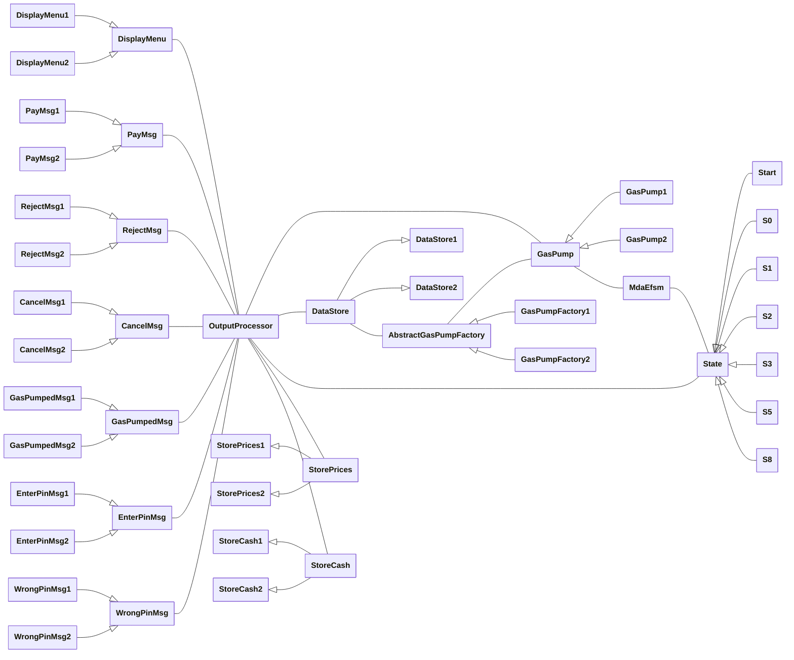

# [Project part 2: Design, implementation and report](https://github.com/hanggrian/IIT-CS586/blob/assets/assignments/proj2_1.pdf)

> The goal of the second part of the project is to design two *Gas Pump*
  components using the Model-Driven Architecture (MDA) and then implement these
  *Gas Pump* components based on this design using the OO programming language.
  This OO-oriented design should be based on the MDA-EFSM for both *Gas Pump*
  components that was identified in the first part of the project. You may use
  your own MDA-EFSM (assuming that it was correct), or you can use the posted
  sample MDA-EFSM. In your design, you MUST use the following OO design
  patterns:
>
> - state pattern
> - strategy pattern
> - abstract factory pattern
>
> In the design, you need to provide the class diagram, in which the coupling
  between components should be minimized and the cohesion of components should
  be maximized (components with high cohesion and low coupling between
  components). In addition, two sequence diagrams should be provided as
  described on the next page (Section 4 of the report). After the design is
  completed, you need to implement the Gas Pump components based on your design
  using the OO programming language. In addition, the driver for the project to
  execute and test the correctness of the design and its implementation for the
  Gas Pump components must be implemented.

## Problem 1

> MDA-EFSM model for the *Gas Pump* components
>
> 1.  A list of meta events for the MDA-EFSM
> 1.  A list of meta actions for the MDA-EFSM with their descriptions
> 1.  A state diagram of the MDA-EFSM
> 1.  Pseudo-code of all operations of the Input Processors of Gas Pumps: *GP-1*
      and *GP-2.*

### Meta events

```vb
activate() 'the gas pump is activated, where a is the price of the gas per '
  'liter'
start() 'start the transaction'

payCash() 'pay for gas by cash'

payCredit() 'pay for gas by a credit card'
approved() 'credit card is approved'
reject() 'credit card is rejected'
cancel() 'cancel the transaction'

payDebit() 'pay for gas by debit card'
correctPin() 'debit card is approved'
incorrectPin(int max) 'incorrect pin entered, max is the maximum number of '
  'attempts allowed'

selectGas(int g) 'select gas type, where g is a gasoline identifier'
startPump() 'start pumping gas'
pump() 'dispense gas'
stopPump() 'stop pumping gas'
```

### Meta actions

```vb
storePrices() 'stores gas prices from the data store'
storeCash() 'stores cash information from the data store'
storePin() 'stores pin information from the data store'

displayMenu() 'shows a menu with a list of selections'
payMsg() 'shows a type of payment method message'
rejectMsg() 'shows credit card not approved message'
cancelMsg() 'shows the cancellation message'
gasPumpedMsg() 'shows gas pumped message'
enterPinMsg() 'shows enter pin message'
wrongPinMsg() 'shows wrong pin message'

setPrice(int g) 'sets the gas price, where g is a gasoline identifier'
resetCounter() 'sets liter (or gallon) counter and total to 0'
pumpGasUnit() 'disposes liter (or gallon) of gas'
printReceipt() 'prints receipt'
returnCash() 'returns the remaining cash'
initializeData() 'initializes data values'
ejectCard() 'ejects the credit (or debit) card'
setCash(boolean isCash) 'sets the flag indicating whether payment is by cash'
```

### State diagram


### Pseudo-code

```vb
class GasPump1 {
  void activate(float a) {
    dataStore.tempA = a
    mdaEfsm.activate()
  }

  void start() {
    mdaEfsm.start()
  }

  void payCash(float c) {
    dataStore.tempC = c
    mdaEfsm.payCash()
  }

  void payCredit() {
    mdaEfsm.payCredit()
  }

  void approved() {
    mdaEfsm.approved()
  }

  void reject() {
    mdaEfsm.reject()
  }

  void cancel() {
    mdaEfsm.cancel()
  }

  void startPump() {
    mdaEfsm.startPump()
  }

  void pumpLiter() {
    IF dataStore.isCash THEN
      mdaEfsm.pump()
    ELSE IF dataStore.cash > 0 AND
      dataStore.cash < dataStore.price * (dataStore.literCount + 1) THEN
      mdaEfsm.stopPump()
    ELSE
      mdaEfsm.pump()
    END IF
  }

  void stopPump() {
    mdaEfsm.stopPump()
  }
}

class GasPump2 {
  void activate(int a, int b) {
    dataStore.tempA = a
    dataStore.tempB = b
    mdaEfsm.activate()
  }

  void start() {
    mdaEfsm.start()
  }

  void payCredit() {
    mdaEfsm.payCredit()
  }

  void approved() {
    mdaEfsm.approved()
  }

  void reject() {
    mdaEfsm.reject()
  }

  void cancel() {
    mdaEfsm.cancel()
  }

  void payDebit(int p) {
    dataStore.tempPin = p
    mdaEfsm.payDebit()
  }

  void pin(int p) {
    IF dataStore.pin == p THEN
      mdaEfsm.correctPin()
    ELSE
      mdaEfsm.incorrectPin(1)
    END IF
  }

  void diesel() {
    mdaEfsm.selectGas(1)
  }

  void regular() {
    mdaEfsm.selectGas(2)
  }

  void startPump() {
    IF dataPrice.price > 0 THEN
      mdaEfsm.startPump()
    END IF
  }

  void pumpGallon() {
    mdaEfsm.pump()
  }

  void stopPump() {
    mdaEfsm.stopPump()
  }

  void fullTank() {
    mdaEfsm.stopPump()
  }
}
```

## Problem 2

> Class diagram(s) of the MDA of the *Gas Pump* components. In your design, you
  **MUST** use the following OO design patterns:
>
> 1.  State pattern
> 1.  Strategy pattern
> 1.  Abstract factory pattern

### Class diagram



#### State pattern


### Strategy pattern


### Abstract factory pattern


## Problem 3

> For each class in the class diagram(s), you should:
>
> 1.  Describe the purpose of the class, i.e., responsibilities.
> 1.  Describe the responsibility of each operation supported by each class.

### Class descriptions

There are two **GasPump** classes. Each class has different price types, payment
methods and gas units.

GasPump1 | Type | Description
--- | --- | ---
a | Float | Price of gas per liter
c | Float | Cash paid by customer
activate(a)<br>start()<br>payCash(c)<br>payCredit()<br>approved()<br>reject()<br>cancel()<br>startPump()<br>pumpLiter()<br>stopPump() | - | Operations supported to interact with MdaEfsm

GasPump2 | Type | Description
--- | --- | ---
a | Integer | Price of Regular gas per gallon
b | Integer | Price of Diesel gas per gallon
p | Integer | Pin number for debit card
activate(a, b)<br>start()<br>payCredit()<br>approved()<br>reject()<br>cancel()<br>payDebit(p)<br>pin(p)<br>diesel()<br>regular()<br>startPump()<br>pumpGallon()<br>stopPump()<br>fullTank() | - | Operations supported to interact with MdaEfsm

Using item description pattern, introduce **DataStore** classes to store data
required by gas pump components. The properties of each data store class follow
the requirements of respective gas pump component.

DataStore1 | Type | Description
--- | --- | ---
tempA | Float | Temporary storage for price of gas per liter
tempC | Float | Temporary storage for cash paid by customer
cash | Float | Cash paid by customer
total | Float | Total cost of gas pumped
literCount | Integer | Number of liters pumped
price | Float | Price of gas per liter
isCash | Boolean | Flag indicating whether payment is by cash

DataStore2 | Type | Description
--- | --- | ---
tempA | Integer | Temporary storage for price of Regular gas per gallon
tempB | Integer | Temporary storage for price of Diesel gas per gallon
tempP | Integer | Temporary storage for pin number
pin | Integer | Pin number for debit card
price | Integer | Price of selected gas per gallon
total | Integer | Total cost of gas pumped
gallonCount | Integer | Number of gallons pumped
regularPrice | Integer | Price of Regular gas per gallon
dieselPrice | Integer | Price of Diesel gas per gallon

The pointer to data store instance is maintained in kept in the classes
implementing **AbstractGasPumpFactory.** Each concrete factory class creates
instances of strategy classes neeeded by the gas pump component.

GasPumpFactory1 | Type | Description
--- | --- | ---
dataStore1 | DataStore1 | Data store instance for GasPump1
displayMenu1<br>payMsg1<br>rejectMsg1<br>cancelMsg1<br>gasPumpedMsg1<br>enterPinMsg1<br>wrongPinMsg1<br>storePrices1<br>storeCash1 | DisplayMenu1<br>PayMsg1<br>RejectMsg1<br>CancelMsg1<br>GasPumpedMsg1<br>EnterPinMsg1<br>WrongPinMsg1<br>StorePrices1<br>StoreCash1 | Factory class to create instances of GasPump1 related classes

GasPumpFactory2 | Type | Description
--- | --- | ---
dataStore2 | DataStore2 | Data store instance for GasPump2
displayMenu2<br>payMsg2<br>rejectMsg2<br>cancelMsg2<br>gasPumpedMsg2<br>enterPinMsg2<br>wrongPinMsg2<br>storePrices2<br>storeCash2 | DisplayMenu2<br>PayMsg2<br>RejectMsg2<br>CancelMsg2<br>GasPumpedMsg2<br>EnterPinMsg2<br>WrongPinMsg2<br>StorePrices2<br>StoreCash2 | Factory class to create instances of GasPump2 related classes

The **MdaEfsm** class maintains the current state of the MDA-EFSM and a
collection of all states. It provides operations to handle meta events and
delegate to the current state.

MdaEfsm | Type | Description
--- | --- | ---
states | State[] | Collection of states in the MDA-EFSM
stateId | Integer | Current state identifier
activate()<br>start()<br>payCash()<br>payCredit()<br>approved()<br>reject()<br>cancel()<br>payDebit()<br>correctPin()<br>incorrectPin(int)<br>selectGas(int)<br>startPump()<br>pump()<br>stopPump() | - | Operations to handle meta events and delegate to current state

Each **State** class implements operations corresponding to meta events. The
operation implementation changes the current state of the MDA-EFSM and invokes
operations of the output processor.

Start | Type | Description
--- | --- | ---
activate() | - | Handles activate event in Start state

S0 | Type | Description
--- | --- | ---
start() | - | Handles start event in S0 state

S1 | Type | Description
--- | --- | ---
payCash()<br>payCredit()<br>payDebit() | - | Handles payCash, payCredit and payDebit events in S1 state

S2 | Type | Description
--- | --- | ---
approved()<br>reject() | - | Handles approved and reject events in S2 state

S3 | Type | Description
--- | --- | ---
cancel()<br>selectGas(int)<br>startPump() | - | Handles cancel, selectGas and startPump events in S3 state

S5 | Type | Description
--- | --- | ---
pump()<br>stopPump() | - | Handles pump and stopPump events in S5 state

S8 | Type | Description
--- | --- | ---
correctPin()<br>incorrectPin(int) | - | Handles correctPin and incorrectPin events in S8 state

Finally, the **OutputProcessor** class maintains a pointer to the data store
instance and provides operations to invoke strategy classes to perform meta
actions.

OutputProcessor | Type | Description
--- | --- | ---
dataStore | DataStore | Data store instance
abstractFactory | AbstractGasPumpFactory | Abstract factory instance
storePrices()<br>storeCash()<br>storePin()<br>displayMenu()<br>payMsg()<br>rejectMsg()<br>cancelMsg()<br>gasPumpedMsg()<br>enterPinMsg()<br>wrongPinMsg()<br>setPrice(int)<br>resetCounter()<br>pumpGasUnit()<br>printReceipt()<br>returnCash()<br>initializeData()<br>ejectCard()<br>setCash(boolean) | - | Operations to invoke strategy classes to perform meta actions

## Problem 4

> Dynamics. Provide sequence diagrams for two Scenarios:
>
> 1.  Scenario-I should show how one liter of gas is dispensed in *GasPump-1,*
      i.e., the following sequence of operations is issued: `activate(4.1)`,
      `start()`, `payCash(5.2)`, `startPump()`, `pumpLiter()`, `pumpLiter()`.
> 1.  Scenario-II should show how one gallon of Regular gas is dispensed in
      *GasPump-2,* i.e., the following sequence of operations is issued:
      `activate(4, 7)`, `start()`, `payDebit(123)`, `pin(124)`, `pin(123)`,
      `regular()`, `startPump()`, `pumpGallon()`, `fullTank()`.

### Scenario 1

#### Sequence diagram


### Scenario 2

#### Sequence diagram


## Problem 5

> In the source code, you should clearly indicate/highlight which parts of the
  source code are responsible for the implementation of the three required
  design patterns:
>
> - State pattern
> - Strategy pattern
> - Abstract factory pattern
>
> The source code must be submitted on Canvas. Note that the source code may be
  compiled during the grading and then executed.

The source code and project configuration files are archived as `src.zip`.

## Problem 6

> The project executable(s) of the *Gas Pump* components, with detailed
  instructions explaining the execution of the program, must be prepared and
  made available for grading. The project executable should be submitted on
  Canvas.

The project executable file is compiled as `gas-pump.jar`, built and run using:

```sh
./gradlew shadowJar

java -jar build/libs/gas-pump.jar edu.illinoistech.hawk.hwijaya.Main
```


