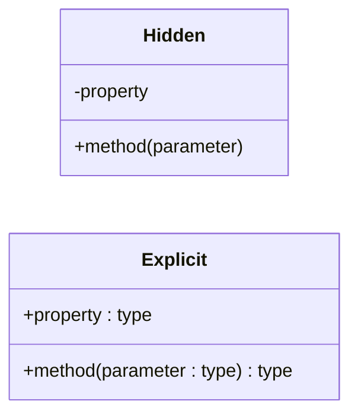
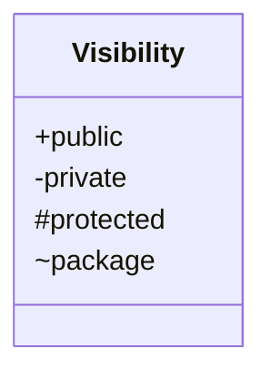
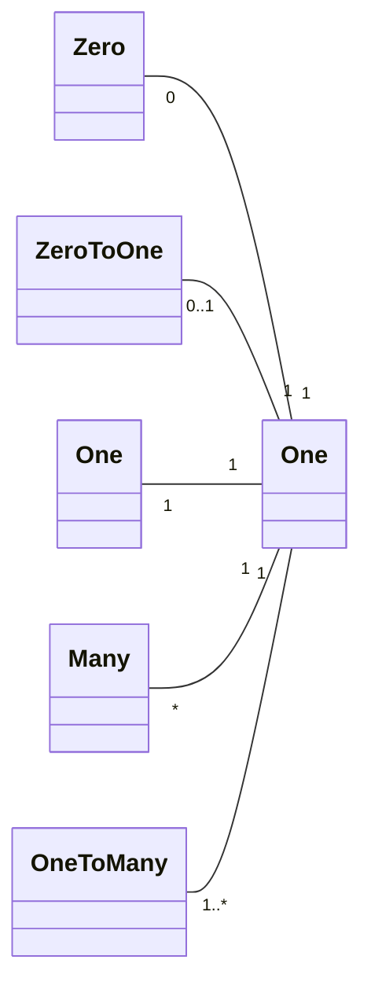
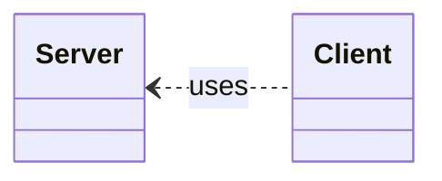
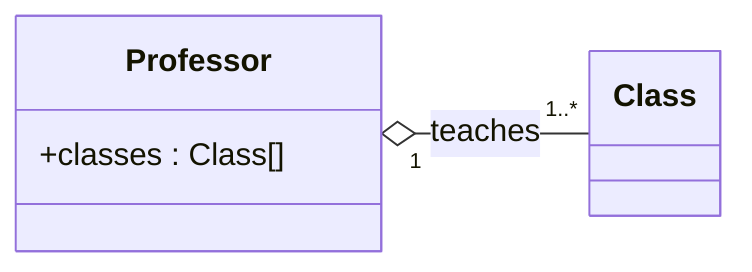
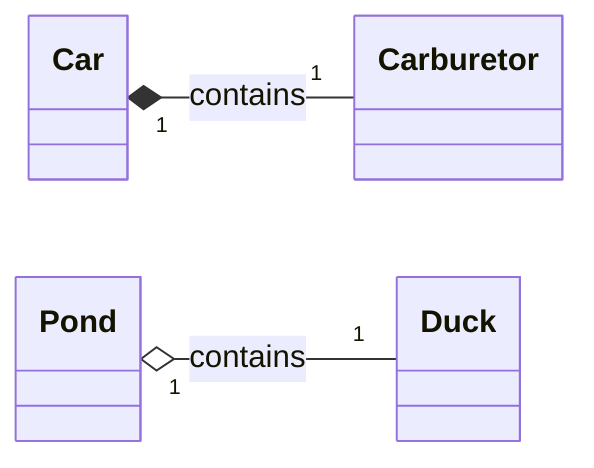
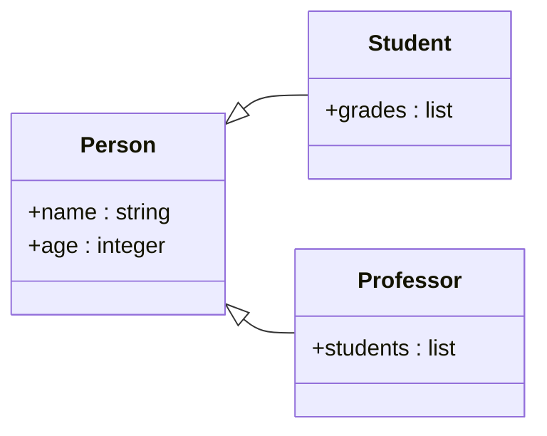
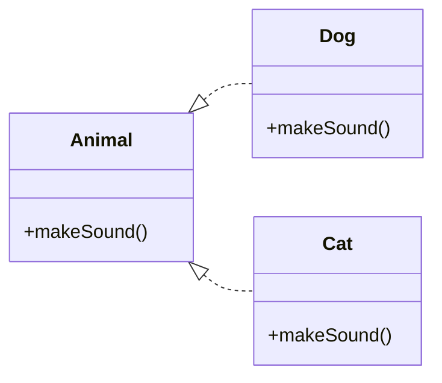

# [Class diagram](https://en.wikipedia.org/wiki/Class_diagram)

## Type explicity

## Member visibility

## Multiplicity

`0..*` and `1..1` are redundant, so they are usually written as `*` and `1`.

## Types of relationships

### Dependency

When changes in one class may affect another class.

### Association/Link

When objects of one class are connected to objects of another class.

### Aggregation

When one class is a part of another class, but can exist independently.

### Composition

When one class is a part of another class, and cannot exist independently.

### Generalization/Inheritance

When a class is a subclass of another class. Overriden properties and methods
must be declared in the subclass.

### Realization/Implementation

When a class implements an interface. All properties and methods of the
interface must be declared in the implementing class.

