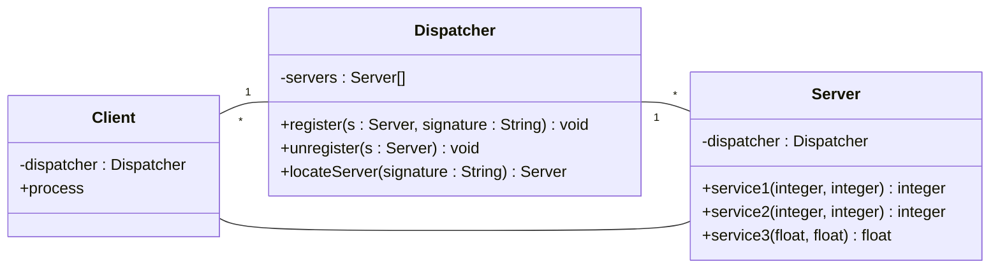
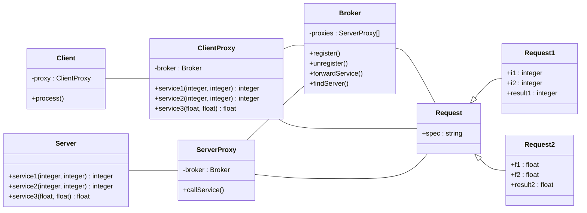

# Client-server architecture

- Client-dispatcher-server
- Client-broker-server

## Client-dispatcher-server

The client communicates directly with the server.

## Client-broker-server

The client communicates with the server via a broker.

