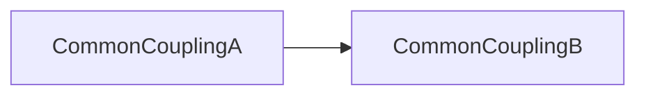
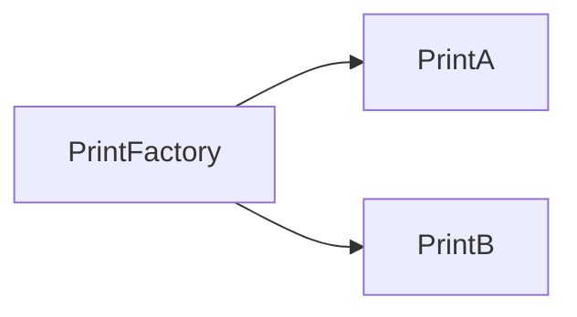
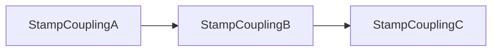
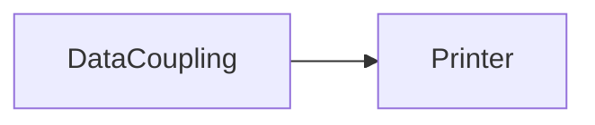

# [Coupling](https://dev.to/parikshithkm/software-engineering-coupling-a-practical-approach-40he)

In software engineering, coupling is the degree of interdependence between
software modules; a measure of how closely connected two routines or modules
are; the strength of the relationships between modules.

## Types of Coupling

- Common coupling (worst)
- Control coupling
- Stamp coupling
- Data coupling (best)

### Common coupling

When multiple modules share the same global data.



```java
public class CommonCouplingA {
  private static int counter;

  public static int getCounter() {
    return counter;
  }

  public static void setCounter(int counter) {
    CommonCouplingA.counter = counter;
  }
}

public class CommonCouplingB {
  public void incrementCounter() {
    int counter = CommonCouplingA.getCounter();
    CommonCouplingA.setCounter(counter++);
  }
}
```

### Control coupling

When a module's control flow is determined by the data passed from another module.



```java
interface PrintInterface {
  public void print();
}

public class PrintA implements PrintInterface {
  @Override
  public void print() {
    System.out.println("Print A");
  }
}

public class PrintB implements PrintInterface {
  @Override
  public void print() {
    System.out.println("Print B");
  }
}

public class PrintFactory {
  public PrintInterface printObject(String letter) {
    switch(letter) {
      case "A" : return new PrintA();
      case "B" : return new PrintB();
      default : return null;
    }
  }
}
```

### Stamp coupling

When objects or data structures are passed between modules, but only a part of the data is used.



```java
public class StampCouplingA {
  private int[] array = {1, 2, 3, 4, 5};
  StampCouplingC c = new StampCouplingC();
  StampCouplingB b = new StampCouplingB();

  public void start() {
    b.callB(array, c);
  }
}

public class StampCouplingB {
  public void callB(int[] array, StampCouplingC c ) {
    System.out.println("Array length: " + array.length);
    System.out.println("Name: " + c.getName());
  }
}

public class StampCouplingC {
  private String name = "Parikshith";

  public String getName() {
    return name;
  }
}
```

### Data coupling

When only the necessary data is passed between modules.



```java
public class DataCoupling {
  int numberA = 1;
  int numberB = 2;
  int numberC = 3;
  boolean allNumbersSet = true;
  Printer printer = new Printer();

  public void caller() {
    printer.print(numberA, numberB, numberC, allNumbersSet);
  }
}

public class Printer {
  public void print(
    int numberA,
    int numberB,
    int numberC,
    boolean allNumbersSet
  ) {
      System.out.println("Number A: " + numberA);
      System.out.println("Number B: " + numberB);
      System.out.println("Number C: " + numberC);
      System.out.println("All numbers set? " + allNumbersSet);
  }
}
```
