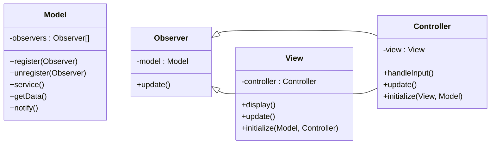
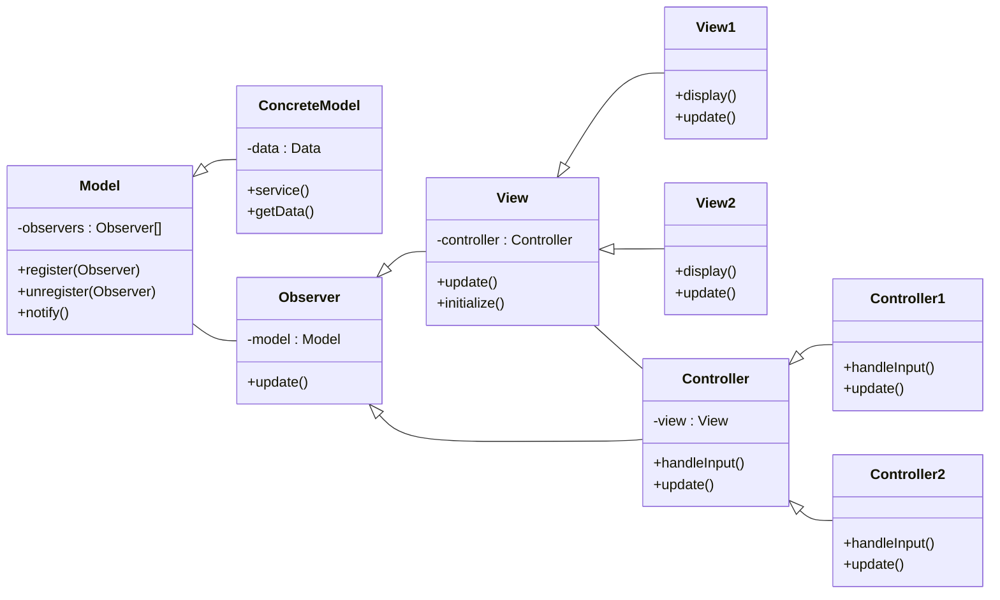

# Interactive systems

- Model-view-controller pattern

## Model-view-controller pattern

Interactive system architecture that separates model (core processing), view
(output) and controller (input).

The same information is represented differently in different UIs.

