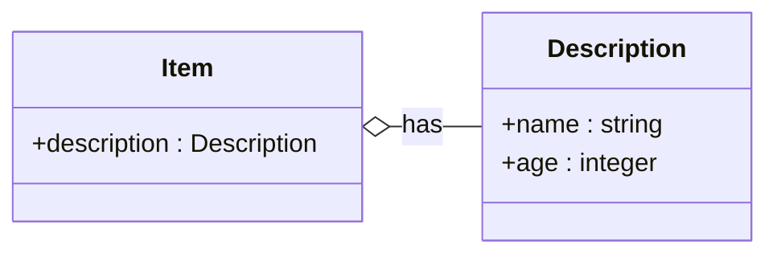
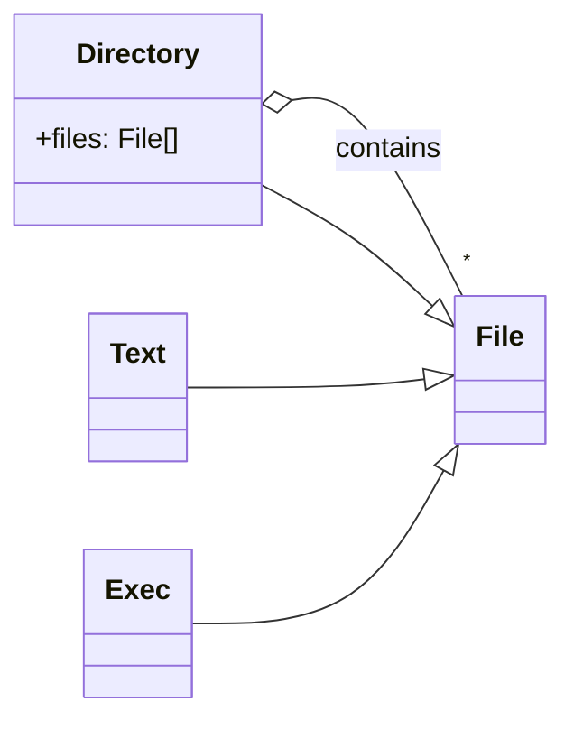
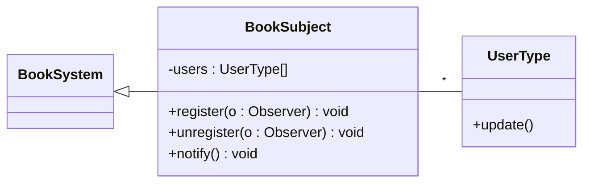
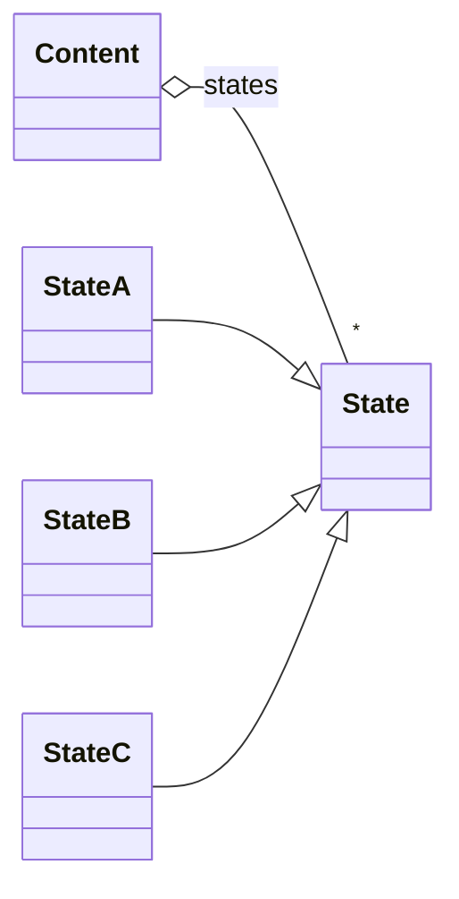
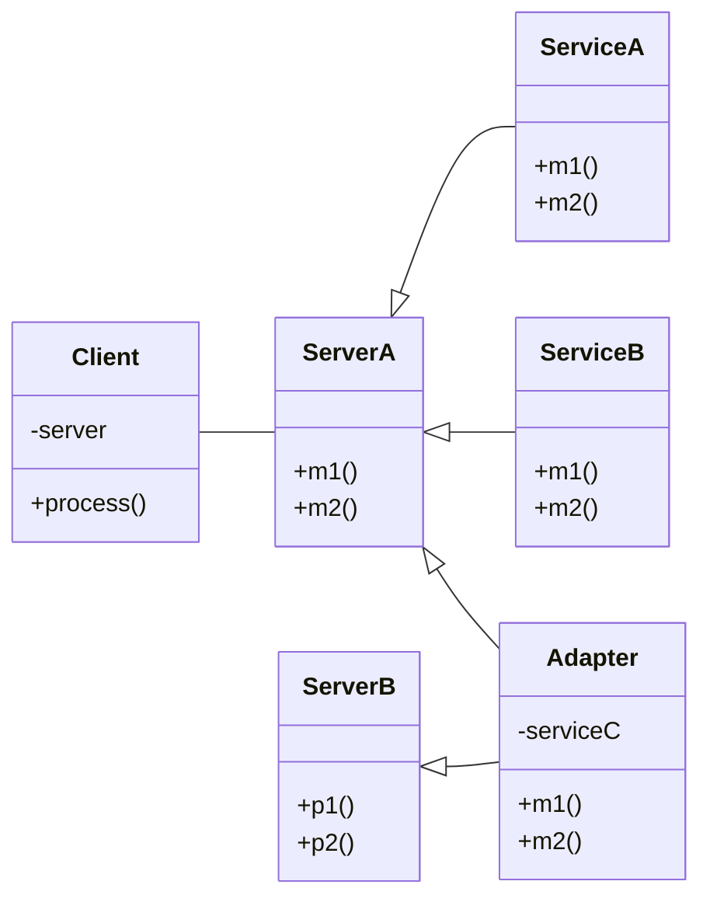
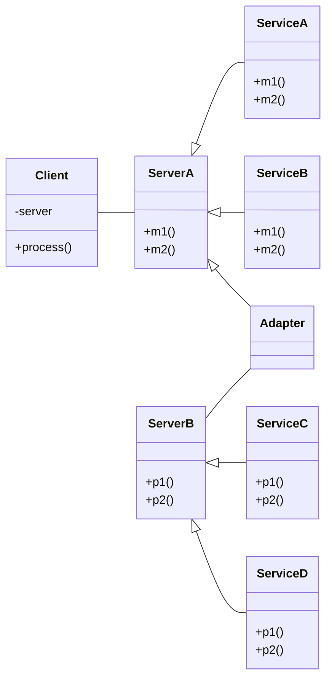
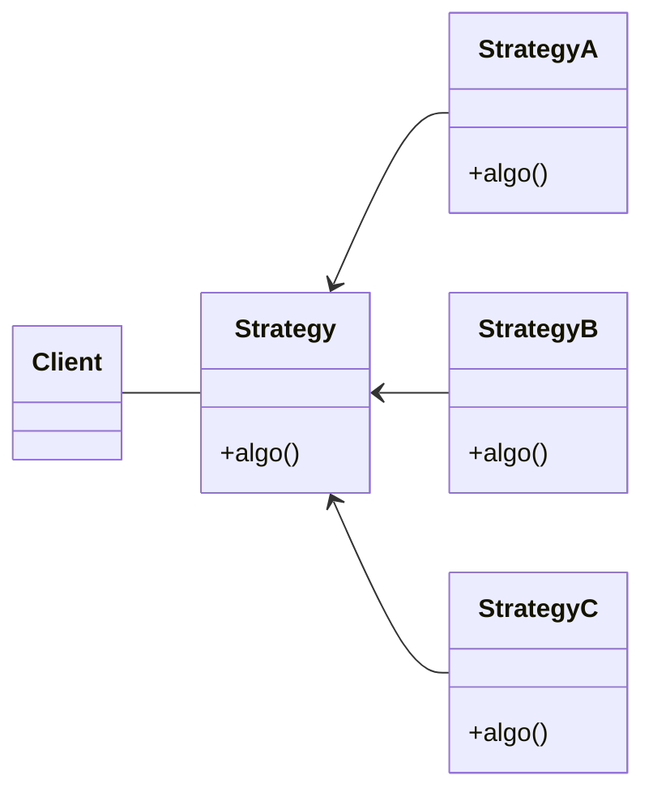
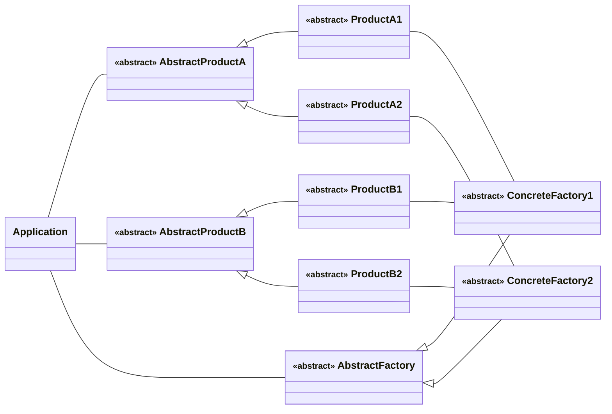

# Object-oriented design patterns

Reuse of design solutions.

## Types of design patterns

- Item description pattern
- Whole-part pattern
- Observer pattern
- State pattern
- Adapter pattern
- Strategy pattern
- Abstract factory pattern

### Item description pattern

Create a new class with description.

### Whole-part pattern

An object consists of parts of different types.

### Observer pattern

Publisher-subscriber model.

### State pattern

Declare state objects to represent different states of a class.

### Adapter pattern

Introduce a wrapper that allows the interface of an existing class to be used as
another interface.

#### Inheritance-based

The servers share a common interface.

### Association-based

The adapter communicates from one server to another with association.

### Strategy pattern

Encapsulate each algorithm or requirement in a separate class.

### Abstract factory pattern

Provides an interface (or abstract class) for creating families of related or
dependent objects without specifying their concrete classes.

