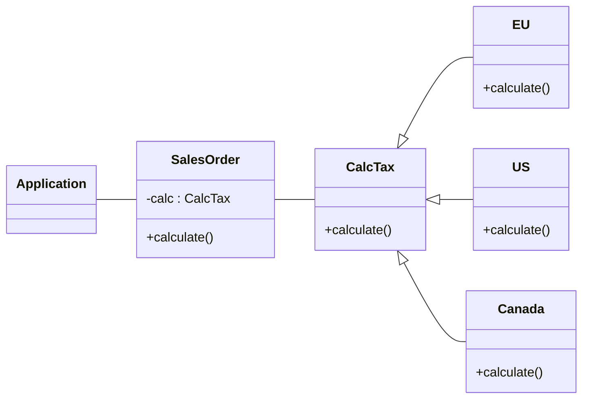

# Object-oriented design patterns

Reuse of design solutions.

## Types of design patterns

- Item description pattern
- Whole-part pattern
- Observer pattern
- State pattern
- Adapter pattern
- Strategy pattern
- Abstract factory pattern
- Proxy pattern
- De-coupling pattern

### Item description pattern

Create a new class with description.

### Whole-part pattern

An object consists of parts of different types.

### Observer pattern

Publisher-subscriber model.

### State pattern

Declare state objects to represent different states of a class.

#### Centralized

#### Decentralized

### Adapter pattern

Introduce a wrapper that allows the interface of an existing class to be used as
another interface.

#### Association-based

The adapter communicates from one server to another with association.

#### Inheritance-based

The servers share a common interface.

### Strategy pattern

Encapsulate each algorithm or requirement in a separate class.

### Abstract factory pattern

Application needs to be de-coupled from the problem of creating the objects.

## Proxy pattern

Coordinate interactions between a client and servers.

### Protection proxy

To protect server from unauthorized access.

### Remote proxy

Search for a location of a server that can provide the service.

## De-coupling pattern

Introduce an intermediary to weaken coupling between modules.

